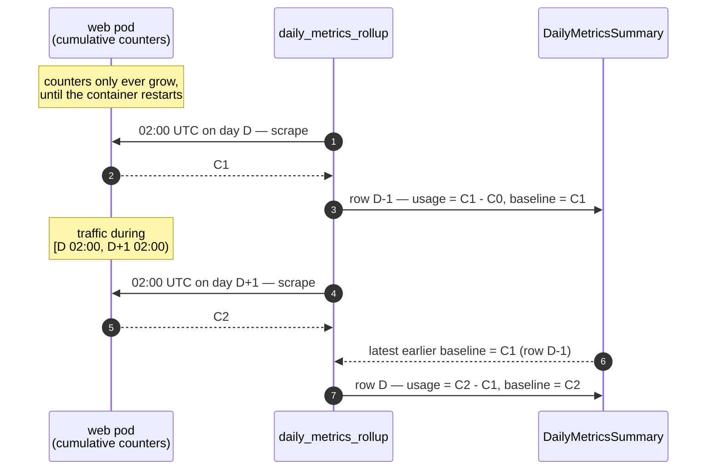

# Analytics Collection

Analytics collection stores the raw output of enabled metrics-utility collectors
in `AnalyticsPayload`. The stored row is a collection envelope: collector name,
source, Controller installation UUID, collection bounds, collection timestamps,
and the raw JSON payload.

The read and trigger APIs are available under `/api/v1/analytics/` and are
restricted to users with the System Administrator or Platform Auditor role.

## Collector Registry

The registry is the source of truth in
[`apps/analytics/registry.py`](../apps/analytics/registry.py). Each entry has:

- `name`: public/API/storage name, in `group.function` form
- `collector_type`: internal task registry key
- `mode`: `hourly`, `daily`, or `snapshot`
- `enabled`: whether the collector is persisted and exposed
- `database`: source database, defaulting to `awx`
- `description`: customer-facing summary of the data returned by the collector
- `note`: explanation for not-enabled entries or a relevant caveat

`accepts_since_until` is derived from `mode`. It describes whether the collector
can receive `since` and `until` bounds; it does not require both bounds to be
present.

## Enabled Collectors

All enabled collectors are persisted and exposed by the read API. Except for
`controller.query_info`, which reports collection metadata, these collectors
read from the Controller (`awx`) database.

| Name | `collector_type` | Mode | `accepts_since_until` | Data extracted |
| --- | --- | --- | --- | --- |
| `controller.unified_jobs_dashboard` | `unified_jobs` | hourly | yes | Job executions, including status and timing, organization, inventory, project, template, execution environment, launcher, labels, and host count. |
| `controller.unified_jobs` | `unified_jobs_base` | hourly | yes | Unified job records with status, timing, organization, inventory, execution environment, template, project SCM type, and job details. |
| `controller.job_host_summary` | `job_host_summary` | hourly | yes | Per-job host results, counts, host connection variables, and job, template, inventory, organization, and project context. |
| `controller.job_host_summary_service` | `job_host_summary_service` | hourly | yes | Per-job host results and counts, with host, job, template, inventory, organization, and project context. |
| `controller.credentials_service` | `credentials_service` | hourly | yes | Distinct managed credential types used by jobs completed in the collection window. |
| `controller.main_jobevent_service` | `main_jobevent_service` | hourly | yes | Selected job events for jobs completed in the window, including event actions, task/play/role, host, result flags, warnings, and deprecations. |
| `controller.main_jobevent` | `main_jobevent_legacy` | hourly | yes | Runner event records associated with job host summaries, including event action, task/play/role, host, and result flags. |
| `controller.events_table` | `events_table` | hourly | yes | Raw job events modified in the window, including event details, playbook statistics, task/play/role, host, timing, warnings, and deprecations. |
| `controller.workflow_job_node_table` | `workflow_job_node_table` | hourly | yes | Workflow job node executions, their job/template/workflow/inventory references, and success, failure, and always edges. |
| `controller.query_info` | `query_info` | hourly | yes | Collection metadata: requested bounds and collection type; it does not query the Controller database. |
| `controller.execution_environments` | `execution_environments` | snapshot | no | Execution environment records, including image, description, ownership, organization, credential, management, and pull settings. |
| `controller.config` | `config` | snapshot | no | Selected Controller settings and license details, plus Controller and metrics-utility versions and runtime platform metadata. |
| `controller.controller_version_service` | `controller_version_service` | snapshot | no | Distinct versions reported by enabled control and hybrid Controller instances. |
| `controller.table_metadata` | `table_metadata` | snapshot | no | Estimated row counts and table, index, and total sizes for the job event, unified job, and job host summary tables. |
| `controller.feature_flags_service` | `feature_flags_service` | snapshot | no | Enabled boolean platform feature flags and their descriptions, support levels, toggle types, and visibility. |
| `controller.counts` | `counts` | snapshot | no | Counts of Controller objects, inventories by kind, non-sync jobs, active hosts and sessions, running and pending jobs, and database connections. |
| `controller.cred_type_counts` | `cred_type_counts` | snapshot | no | Credential counts grouped by credential type, including type name and whether the type is managed. |
| `controller.host_metric_summary_monthly_table` | `host_metric_summary_monthly_table` | snapshot | no | Monthly host capacity and usage summaries, including hosts added, deleted, and indirectly managed. |
| `controller.instance_info` | `instance_info` | snapshot | no | Controller instance topology, version, capacity, CPU, memory, node type, enablement, and current and remaining capacity. |
| `controller.inventory_counts` | `inventory_counts` | snapshot | no | Inventory names and kinds with host and source counts, source details, and smart inventory entries. |
| `controller.org_counts` | `org_counts` | snapshot | no | Organization names with distinct user and team counts. |
| `controller.projects_by_scm_type` | `projects_by_scm_type` | snapshot | no | Project counts grouped by source-control type, with empty types reported as manual. |
| `controller.unified_job_template_table` | `unified_job_template_table` | snapshot | no | Unified job template identity, type, execution environment, ownership, last/current/next job references, scheduling, and status. |
| `controller.workflow_job_template_node_table` | `workflow_job_template_node_table` | snapshot | no | Workflow job template node definitions, inventory and template references, convergence settings, and success, failure, and always edges. |
| `controller.main_host` | `main_host` | snapshot | no | Enabled inventory hosts with inventory and organization context, last automation time, connection variables, and selected hardware and system facts. |
| `controller.main_host_daily` | `main_host_daily` | daily | yes | Enabled hosts created or modified in the window, with the same inventory, organization, automation, connection, and selected fact data as `main_host`. |
| `controller.main_hostmetric` | `main_hostmetric` | daily | yes | Host automation and deletion metrics, counters, inventory usage, and selected host identity and connection facts. |
| `controller.main_indirectmanagednodeaudit` | `indirect_managed_nodes` | daily | yes | Audit records for indirect managed nodes, including their organization and collection data. |

## Not-enabled Collectors

These entries remain in the registry so their status and reason are visible to
developers. They are not exposed by the analytics API. Some may still be used by
other service pipelines.

| Name | `collector_type` | Reason |
| --- | --- | --- |
| `service.task_executions_service` | `task_executions_service` | Used by the anonymized collection pipeline only; not exposed by the analytics API. |
| `controller.config_django` | `config_django` | AWX in-process collector superseded by the SQL `config` collector. |
| `others.total_workers_vcpu` | `total_workers_vcpu` | Prometheus/CLI billing path, not registered in metrics-service. |
| `dashboard.dashboard_jobs` | `dashboard_jobs` | Belongs to the separate dashboard synchronization pipeline. |

## Read API

The analytics root lists enabled collectors and links to their row and collection-task endpoints:

```http
GET /api/v1/analytics/
```

The response contains entries such as:

```json
{
  "collectors": [
    {
      "name": "controller.config",
      "description": "Selected Controller settings and license details, plus Controller and metrics-utility versions and runtime platform metadata.",
      "mode": "snapshot",
      "accepts_since_until": false,
      "rows_url": "https://metrics.example.com/api/v1/analytics/controller.config/",
      "collect_url": "https://metrics.example.com/api/v1/analytics/controller.config/collect/"
    }
  ]
}
```

The collector endpoint returns paginated collection envelopes:

```http
GET /api/v1/analytics/controller.unified_jobs_dashboard/
```

```json
{
  "count": 1,
  "next": null,
  "previous": null,
  "results": [
    {
      "id": 42,
      "collector": "controller.unified_jobs_dashboard",
      "source": "local",
      "cluster_id": "2aebf27a-42ee-4e15-93d0-8bd5f9b52219",
      "since": "2026-08-17T10:00:00Z",
      "until": "2026-08-17T11:00:00Z",
      "started_at": "2026-08-17T11:01:02Z",
      "finished_at": "2026-08-17T11:01:08Z",
      "payload": [
        {"id": 100, "status": "successful"},
        {"id": 101, "status": "failed"}
      ]
    }
  ]
}
```

The actual list response includes `count`, `next`, `previous`, and `results`.
Use `page` and `page_size` for pagination. `count_disabled=true` can omit the
count and navigation links when supported by the paginator.

### Window Filters

Filtering uses half-open interval overlap. A stored row matches a query when:

```text
stored_until IS NULL OR stored_until > query_since
stored_since IS NULL OR stored_since < query_until
```

The comparisons are applied only when the corresponding query bound is present.
Therefore:

- No query bounds returns every collection for the collector, newest first.
- `?since=2026-08-17T11:00:00Z` means `[11:00, +infinity)`.
- `?until=2026-08-17T11:00:00Z` means `(-infinity, 11:00)`.
- Both bounds filter the requested `[since, until)` interval.
- Invalid timestamps and `until <= since` return `400`.

Examples:

| Stored row | Query | Result |
| --- | --- | --- |
| `[10:00, 11:00)` | `[10:00, 11:00)` | match |
| `[10:00, 11:00)` | `[11:00, 12:00)` | no match |
| `[09:00, 10:00)` | `[10:00, 11:00)` | no match |
| `[10:00, infinity)` | `(-infinity, 11:00)` | match |
| `(-infinity, 11:00)` | `[11:00, 12:00)` | no match |
| `[null, null]` | any valid query | match |

Every successful collection is retained. Repeated windows and repeated snapshots
are not upserts.

## Usage Telemetry

Each enabled collector row `GET` records two Prometheus metrics:

| Metric | Type | Label | Unit |
| --- | --- | --- | --- |
| `analytics_collector_get_requests_total` | Counter | `collector` | requests |
| `analytics_collector_get_duration_milliseconds` | Histogram | `collector` | milliseconds |

The `collector` label is the fully qualified public registry name, such as
`controller.unified_jobs_dashboard`. It is selected from the enabled collector
registry and cannot be supplied by the request. No query parameters, payload
contents, organization names, hostnames, or other customer values are labels.
The histogram uses millisecond buckets and exports `_sum` and `_count`.

In production, Metrics Service sets `PROMETHEUS_MULTIPROC_DIR` during settings
startup and creates a writable directory under the container's temporary
directory. Gunicorn workers in the web pod share that directory. The existing
`/api/v1/metrics` view uses `MultiProcessCollector` to combine those workers.
It also retains the default Python GC, platform, and process collectors from
the worker serving the scrape; those process-specific values are not summed
across workers. Any future custom non-multiprocess collector must be explicitly
added to this endpoint's multiprocess registry.
The default directory is container-local and is not shared with the dispatcher
or other web pods; if overriding it, use a writable per-pod path and ensure it
starts empty once per container lifecycle, never by clearing it from each worker.
The dispatcher does **not** read its own registry or mount the web pod's
directory; it scrapes the web Service over HTTP using
`METRICS_SERVICE_INTERNAL_PROMETHEUS_URL`. The scrape carries a locally signed
DAB resource-server service token, accepted only by this metrics view. This
service-to-service request uses the in-cluster Service directly and does not
route through the AAP Gateway.

The cumulative scrape is stored privately in
`DailyMetricsSummary.analytics_usage_snapshot`; that field is never passed to
the anonymizer. `analytics_usage` contains only deltas since the previous
successful scrape, with `request_count`, `duration_ms_total`, and
`duration_ms_average` for each collector. The first successful scrape saves a
baseline and reports `{}`.

### What interval a daily figure covers



The rollup for summary date `D` runs at 02:00 UTC on `D+1` and diffs the scrape
it takes then against the baseline left by the previous successful scrape —
normally the one on `D-1`'s row, taken at 02:00 UTC on `D`. So the figures
attributed to `D` cover **`[D 02:00 UTC, D+1 02:00 UTC)`**: the last 22 hours of
`D` plus the first two hours of `D+1`. It is not a midnight-to-midnight calendar
day, and the offset is fixed by the rollup cron, not by the summary date.

Caveats worth knowing before using these numbers:

| Caveat | Effect |
| --- | --- |
| The window is shifted, not aligned | Two hours of the traffic reported for `D` actually happened on `D+1`. |
| The window is not always 24 hours | A failed scrape saves no baseline, so the next success diffs against the last good one and attributes the whole multi-day span to a single summary date. Nothing is lost; it is lumped. |
| Nothing normalizes for window length | `observed_at` is stored on the baseline but never read — the delta is purely `C_n - C_n-1`. A `request_count` covering three days is indistinguishable downstream from a one-day one, so treating these as daily rates overstates after any scrape outage. |
| A web container restart resets the counters | The multiprocess directory is container-local and starts empty, so the counters go back to zero. The drop is detected per collector (any of `request_count`, `duration_ms_total`, `duration_sample_count` going backwards), logged as a warning, and the current value is used as that interval's delta — which silently under-reports everything between the last scrape and the restart. |
| Gunicorn worker recycling does **not** reset | Each worker writes pid-keyed files that `MultiProcessCollector` sums, so retired workers still count toward the total. Only losing the directory resets. |
| Multiple web replicas corrupt deltas | Multiprocess mode aggregates workers within one pod only, so each scrape reaches whichever replica the Service picked. Alternating between independent cumulative counters can skew a delta in either direction, including spurious reset warnings. Keep one web replica until per-pod scraping exists. |
| A date is measured once | Re-running a rollup for a date that already has a baseline keeps the usage and baseline it recorded (status `preserved`). A late collector retry therefore cannot widen the measured interval, and re-anonymizing cannot ship an interval that overlaps an earlier payload. A scrape that *failed* saves no baseline, so retrying that date does still measure it. |
| Historical backfill reports nothing | A rollup for any date other than yesterday omits this telemetry rather than assigning current usage to a past date, and leaves any usage that date already recorded untouched. |

The baseline is written inside the same `update_or_create` as the summary
itself, at about 02:00, and only when the scrape succeeded — a failed scrape
omits the field and leaves the previous baseline as the anchor. `observed_at` is
taken after the scrape returns, so it trails the values it stamps by well under
a second.

The anonymized payload carries deltas under the separate `analytics_usage` key;
they never travel directly from an API request to Segment and do not use the
`dashboard_telemetry` key. With no samples, the usage object is empty, and the
average is `null` when the interval has no duration observations.

Example:

```json
{
  "analytics_usage": {
    "controller.unified_jobs_dashboard": {
      "request_count": 42,
      "duration_ms_total": 613.0,
      "duration_ms_average": 14.6
    }
  }
}
```

### Configuring the internal scrape URL

The Django setting is `INTERNAL_PROMETHEUS_URL`, overridden by the environment
variable `METRICS_SERVICE_INTERNAL_PROMETHEUS_URL`. **Production ships it
empty**, so every deployment must supply its own value: each production topology
runs web and tasks apart, and the correct URL depends on deployment-specific
naming the service cannot infer — the operator needs its CR name, the
containerized installer its api port. A loopback default would be plausible but
wrong everywhere, failing as a silent connection refused once a day; unset
instead logs an error and reports `not_configured` on the rollup task result.

Development mode keeps a `http://127.0.0.1:8000/api/v1/metrics` default, because
`tools/dev.sh` runs everything on one host.

Where an override is needed, use the existing deployment settings mechanism
rather than adding another operator API field:

- Operator (standalone MetricsService CR or AAP-managed): **required**.
  `automation-metrics-operator` runs separate web, tasks, and scheduler
  Deployments, so the loopback default resolves to the tasks pod itself and the
  scrape is refused. Set `INTERNAL_PROMETHEUS_URL` to
  `http://<CR name>-service:8000/api/v1/metrics` through `spec.extra_settings`,
  or `spec.metrics.extra_settings` on the parent AAP CR. The Service forwards
  8000 to the web pod's nginx on 8080, whose catch-all location proxies to
  Gunicorn on `127.0.0.1:8050`. No NetworkPolicy change is needed: the web
  policy already admits pods labelled
  `app.kubernetes.io/managed-by: metrics-operator` on 8080, and tasks egress is
  unrestricted.
- Containerized installer: the installer sets it for the tasks container from
  `automationmetrics_api_port` (default `8006`, **not** 8000). All metrics
  containers use host networking, so `http://127.0.0.1:<automationmetrics_api_port>/api/v1/metrics`
  reaches the web container's Gunicorn directly. Override with
  `automationmetrics_extra_settings` if the topology differs.
- `aap-dev`: the direct `make aap` setup uses a local ConfigMap overlay; the
  operator-based `make aap-operator` setup uses the child CR's existing extra
  settings. These are separate deployment paths.
- Local process tests: `tools/dev.sh --init` uses the development localhost
  default. The Metrics Utility `compose-service` profile has separate web and
  dispatcher containers, so Metrics Utility's own compose file sets the
  dispatcher's URL to `http://metrics-service-web:8000/api/v1/metrics`.

Metrics Service's own split production Compose file already sets the dispatcher
URL to `http://web:8000/api/v1/metrics` and binds Gunicorn on the private Compose
network; the port is not published to the host.

### Checking whether the scrape worked

Usage telemetry never fails the daily rollup, so a broken scrape leaves the rest
of the payload intact. The `daily_metrics_rollup` task result carries
`analytics_usage_status` so a misconfigured deployment is visible through
`GET /api/v1/tasks/` without reading dispatcher logs:

| Status | Meaning |
| --- | --- |
| `ok` | Scraped and diffed against the previous baseline. |
| `baseline` | First successful scrape; baseline saved, no deltas reported yet. |
| `preserved` | The date was already measured; the recorded usage and baseline were kept. |
| `skipped` | Backfill of a date other than yesterday; no scrape attempted. |
| `not_configured` | `INTERNAL_PROMETHEUS_URL` is empty. |
| `scrape_failed` | The endpoint was unreachable, timed out, or returned an error. |
| `delta_failed` | The scrape succeeded but the stored baseline could not be diffed. |

### Troubleshooting usage telemetry

| Symptom | Likely cause and checks |
| --- | --- |
| Production fails to create Prometheus metrics or reports only one worker | `PROMETHEUS_MULTIPROC_DIR` must be set before `prometheus_client` is imported, and the web process user must be able to create files there. Metrics Service sets it early in production settings and creates the directory; override the path with `METRICS_SERVICE_PROMETHEUS_MULTIPROC_DIR` if needed. Creating that directory is deliberately fatal at startup — a read-only root filesystem is not a supported deployment, and failing loudly beats booting into silently dropped worker metrics. All Gunicorn workers in the same web pod must use that same local path. The dispatcher does not share it, and different web pods must not share a multiprocess directory. |
| The first payload has `"analytics_usage": {}` | Expected: the first successful scrape only records the cumulative baseline. The next successful scrape reports its delta. |
| Every payload is empty and the rollup reports `not_configured` | Set the existing `INTERNAL_PROMETHEUS_URL` deployment setting as described above. Production ships this setting empty on purpose; every deployment must set its own internal web URL. |
| The rollup reports `delta_failed` | The scrape succeeded but the stored `analytics_usage_snapshot` could not be diffed — typically a hand-edited row or a restored dump. The day's summary and payload are still written; clear the bad snapshot and the next run re-establishes a baseline. |
| Scrapes fail with connection refused, timeout, or 404 | Check the URL, port, endpoint path, and task-to-web network policy. The operator uses `http://<MetricsService CR name>-service:8000/api/v1/metrics`; containerized installer uses `http://127.0.0.1:<automationmetrics_api_port>/api/v1/metrics`; production split Compose uses the un-published Gunicorn backend at `web:8000`, and Metrics Utility `compose-service` uses `metrics-service-web:8000`. |
| Scrape returns 400 `DisallowedHost` or a redirect | Include the internal service hostname in `ALLOWED_HOSTS` and use the canonical `/api/v1/metrics` endpoint URL directly. The internal scraper does not follow redirects, so a misrouted HTTP-to-HTTPS redirect fails open with empty usage. |
| Scrapes return 401/403 | The dispatcher signs `X-ANSIBLE-SERVICE-AUTH` with `RESOURCE_SERVER__SECRET_KEY`; confirm the web and tasks workloads use the same resource-server secret and that `init-service-id` has run. Ordinary API users still need the normal admin/auditor JWT. |
| The endpoint is reachable but analytics samples are absent | Confirm requests reached enabled collector row endpoints. Unknown collector names and samples with extra labels are rejected; collectors with no requests may have no series yet. Known disabled series are retained only in the private baseline and never emitted. |
| Metrics appear inconsistent after scaling web replicas | Multiprocess mode aggregates Gunicorn workers **within one web pod only**. The default operator deployment has one web replica. With multiple web replicas, each Service scrape reaches one pod; switching between independent cumulative counters can corrupt deltas in either direction. Keep one web replica until per-pod scraping is implemented. |
| Counts drop or log a counter reset | The web multiprocess directory was reset, usually after a container/pod restart. The next payload uses values since reset as a best-effort delta; requests between the last baseline and reset cannot be recovered. If post-reset counts already exceed the prior snapshot, a counter-decrease check cannot detect the reset, so the interval can be understated or misattributed. This is approximate adoption telemetry, not accounting. The default temporary path resets with the container; if using persistent storage, clear it once before starting the whole web container, never from each worker or while workers are running. |
| A scrape failure is followed by a larger delta | Failed scrapes leave the last good baseline intact, so the next successful delta spans the missed scrape interval. A historical rollup intentionally does not advance the baseline. |
| The API response fails while telemetry is unavailable | Instrumentation errors are logged and swallowed; telemetry must not change the collector API response. |
| A deployed image still behaves like the old code | Confirm the running image includes this Metrics Service source revision. The product image pins a downstream source submodule and must be rebuilt after the downstream source is synchronized. |
| Local Compose or development works differently from AAP | `make compose` starts the Metrics Utility base dependencies; `make compose-service` adds separate web and dispatcher containers plus the Metrics Service-owned URL override. `tools/dev.sh --init` runs `runserver`, dispatcher, and scheduler as separate host processes and uses the development localhost URL. In `aap-dev`, the direct `make aap` deployment and operator-based setup (`make aap-operator` in this checkout) are distinct; check the static ConfigMap for the former and set the existing extra setting in the child CR for the latter. |
| CI passes but the Utility service CI did not test this source branch | Metrics Service GitHub pytest runs in test mode with the scrape mocked, so it verifies parsing/deltas/auth unit behavior but not cluster DNS. Metrics Utility's `pytest-service` job checks out Metrics Service `devel`; run the Metrics Service PR's full suite for this branch and use the Utility compose/service profile with its URL setting to verify local cross-process wiring. |

### Triggering Collection

The collector trigger creates a normal pending `Task`. It does not execute the
collector in the web request, create a payload row, claim a window, or coordinate
with another request. The scheduler discovers and dispatches the task through the
normal task machinery.

```http
POST /api/v1/analytics/controller.config/collect/
```

For a snapshot, an empty JSON body uses the collector defaults:

```json
{}
```

The response is `202 Accepted` and includes `task_id`, `task_url`, `collector`,
and the resolved `task_data`. Each request creates a separate task, even when
the collector and bounds are identical.

Window-capable collectors accept no bound, one bound, or both bounds. A missing
key receives the normal hourly or daily default; an explicit JSON `null` leaves
that bound open. Thus `{}` fills both defaults, `{"since": null}` fills only
the default `until`, and `{"since": null, "until": null}` is unbounded.
Invalid timestamps and reversed complete ranges return `400`.
Collection tasks always use the
storage default source, `local`; source selection is not part of the task or POST
contract.

## Creating Collection Tasks

Tasks are created through `POST /api/v1/tasks/`. The task API accepts
`function_name`, JSON `task_data`, optional `scheduled_time`, and optional
`cron_expression`. Immediate tasks omit both scheduling fields. The scheduler
submits immediate tasks during its periodic sync; recurring task rows create a
new child task on each cron fire.

### One Snapshot With Defaults

For a snapshot, only the public collector name is needed:

```http
POST /api/v1/tasks/
```

```json
{
  "name": "analytics-config-once",
  "function_name": "collect_analytics_on_demand",
  "task_data": {
    "collector": "controller.config"
  },
  "scheduled_time": null,
  "cron_expression": null
}
```

The task uses the collector's default behavior. A snapshot receives no
`since`/`until` bounds.

### Recurring Cron Tasks

Use the dedicated recurring-task endpoint for recurring collection:

```http
POST /api/v1/tasks/schedule_recurring/
```

Recurring tasks must use the mode-specific collection function. The scheduler
uses the function name to inject the rolling default window at dispatch time:

| Mode | `function_name` | `task_data` | Default collection |
| --- | --- | --- | --- |
| Hourly | `collect_hourly_metrics` | `collector_type` | Previous full hour |
| Daily | `collect_daily_metrics` | `collector_type` | Previous calendar day |
| Snapshot | `collect_snapshot_metrics` | `collector_type` | Current state, no window |

For example, a daily recurring task is:

```json
{
  "name": "analytics-main-host-daily",
  "function_name": "collect_daily_metrics",
  "task_data": {
    "collector_type": "main_host_daily"
  },
  "cron_expression": "0 2 * * *"
}
```

Do not use `collect_analytics_on_demand` for a recurring hourly or daily task
when the rolling default window is wanted. Without explicit bounds, that
function passes an unbounded window to hourly/daily collectors; the scheduler's
default-window injection applies to the three mode-specific functions above.

The response contains a success message and `task_id`. The recurring row is a
template. Each cron fire creates a non-recurring child task, which is then
dispatched normally. One-off collections, including custom hourly or daily
windows, use `collect_analytics_on_demand` through the analytics trigger
endpoint described above.

### Custom Window Task

For a specific collection window, pass ISO timestamps in `task_data`:

```json
{
  "name": "analytics-unified-jobs-hour",
  "function_name": "collect_analytics_on_demand",
  "task_data": {
    "collector": "controller.unified_jobs_dashboard",
    "since": "2026-08-17T10:00:00Z",
    "until": "2026-08-17T11:00:00Z"
  },
  "scheduled_time": null,
  "cron_expression": null
}
```

The trigger POST maps directly to the same task data: a snapshot POST with no
body creates the name-only task, while a request body containing `since` and
`until` creates the custom-window task. Claims, overlap coordination, and
re-collection decisions are intentionally not part of this contract.
