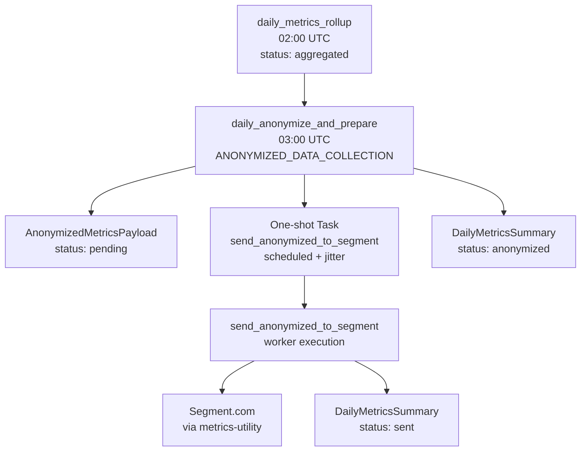
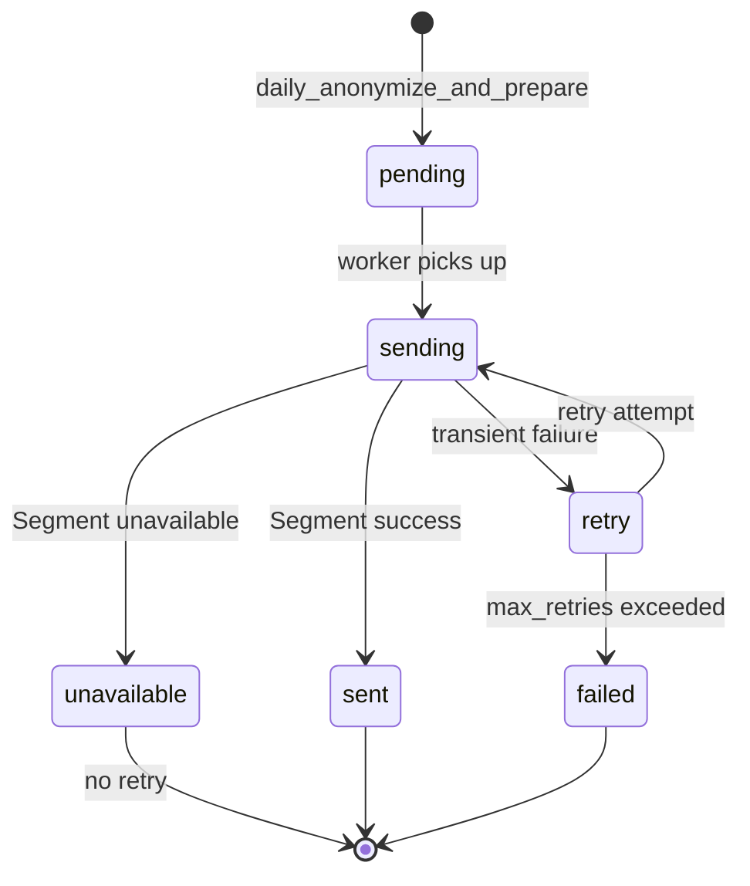

# Anonymization and Transmission

This document describes the **upstream metrics path**: daily rollup
anonymization and transmission to Segment (Red Hat analytics). Local-only data
such as dashboard `JobData` is **not** part of this pipeline.

Prerequisites: [collectors.md](collectors.md) (rollup creation) and
[dynamic-settings.md](dynamic-settings.md) (`ANONYMIZED_DATA_COLLECTION` enablement).

## Pipeline Overview



| Stage | Task / model | Output status |
|-------|----------------|---------------|
| Rollup | `DailyMetricsSummary` | `aggregated` |
| Anonymize | `daily_anonymize_and_prepare` | summary → `anonymized`, payload → `pending` |
| Schedule send | `Task` (scheduled one-shot) | payload → `sending` → `sent` or retry |
| Complete | `DailyMetricsSummary` | `sent` |

Gated by **`ANONYMIZED_DATA_COLLECTION`** feature enablement setting. When
disabled, anonymization and Segment tasks are skipped; local collectors can
still run under `METRICS_COLLECTION`.

## daily_anonymize_and_prepare

`apps/tasks/collectors/daily_anonymize_and_prepare.py`

1. Loads `DailyMetricsSummary` for yesterday with `status="aggregated"`.
2. Calls `metrics_utility.anonymized_rollups.anonymize_rollups()` on merged collector rollups.
3. Adds `summary_metadata` (`install_type`, collection counts, missing hours).
4. Embeds `dashboard_telemetry` from rollup metrics (collection performance, not raw jobs).
5. Creates `AnonymizedMetricsPayload` with `status="pending"`.
6. Sets summary `status="anonymized"`.
7. Creates a **scheduled** `send_anonymized_to_segment` task with random jitter
   (1–240 minutes) to spread transmission load.

Uses advisory locking and `max_attempts=7` (`SEGMENT_MAX_ATTEMPTS` in
`task_groups.py`) for the anonymize task itself.

### What is anonymized

Rollup JSON from collectors (jobs, credentials, event modules, execution
environments, controller version, table metadata, **platform** `feature_flags_service`
snapshot, task executions observability, indirect nodes if collected).

**Not included:** raw `JobData` rows, user-identifiable AWX job detail used by
the dashboard API. See [dashboard-reports-api.md](dashboard-reports-api.md).

## send_anonymized_to_segment

`apps/tasks/collectors/send_anonymized_to_segment.py`

Processes `AnonymizedMetricsPayload` rows via `metrics_utility.library.storage.segment.StorageSegment`.

### Payload status lifecycle



| Status | Meaning |
|--------|---------|
| `pending` | Ready to send |
| `sending` | In flight (stale `sending` recovered after threshold) |
| `sent` | Successfully transmitted |
| `retry` | Failed but `retry_count < max_retries` |
| `failed` | Max retries exhausted |
| `unavailable` | Segment library unavailable — not retried |

`DailyMetricsSummary` mirrors terminal success as `sent`.

### Retry behavior

- Payload-level: `retry_count` / `max_retries` (default 3 on payload)
- Task-level: `send_anonymized_to_segment` one-shot tasks use `SEGMENT_MAX_ATTEMPTS` (7)
- Stale recovery: payloads stuck in `sending` beyond threshold are retried

Broker-level dispatcherd retries are separate from application retries — see
[task-state-machine.md](task-state-machine.md).

## Segment Configuration

Loaded at startup via `apps/core/segment.py` and `apps/settings/defaults.py`:

| Source | Variable |
|--------|----------|
| Environment | `METRICS_SERVICE_SEGMENT_WRITE_KEY` |
| File | `METRICS_SERVICE_SEGMENT_WRITE_KEY_FILE` (default `/etc/ansible-automation-platform/metrics/segment-write-key`) |
| Dynaconf | `SEGMENT_WRITE_KEY` in settings |

Precedence: env/settings key wins; file load skipped if already set.

| Setting | Purpose |
|---------|---------|
| `SEGMENT_TEST_MODE` | Appends `_Test` to event name for non-production sends |
| `INSTALL_TYPE` | Included in anonymized `summary_metadata` (`containerized`, etc.) |

Event name default: `Controller Metrics Daily Rollup` (or test suffix).

## Opt-Out

Customers can disable upstream transmission while keeping local collection:

```bash
METRICS_SERVICE_FEATURE__ANONYMIZED_DATA_COLLECTION=false
```

Or insert a `false` row in `dynamic_settings_setting` for key
`ANONYMIZED_DATA_COLLECTION` (survives upgrades; no restart needed for DB toggle).

Local rollups in `HourlyMetricsCollection` / `DailyMetricsSummary` continue when
`METRICS_COLLECTION` remains enabled.

## Data Retention

`cleanup_metrics_data` (daily 04:00) removes old hourly collections, daily
summaries, and payloads per retention args in `task_groups.py` (`hourly_retention_days`,
`daily_retention_days`, `payload_retention_days`).

## Related Documentation

- [collectors.md](collectors.md) — collector schedules and rollup step
- [data-models.md](data-models.md) — `DailyMetricsSummary`, `AnonymizedMetricsPayload`
- [dynamic-settings.md](dynamic-settings.md) — enablement settings
- [dashboard-sync.md](dashboard-sync.md) — separate local dashboard data path
