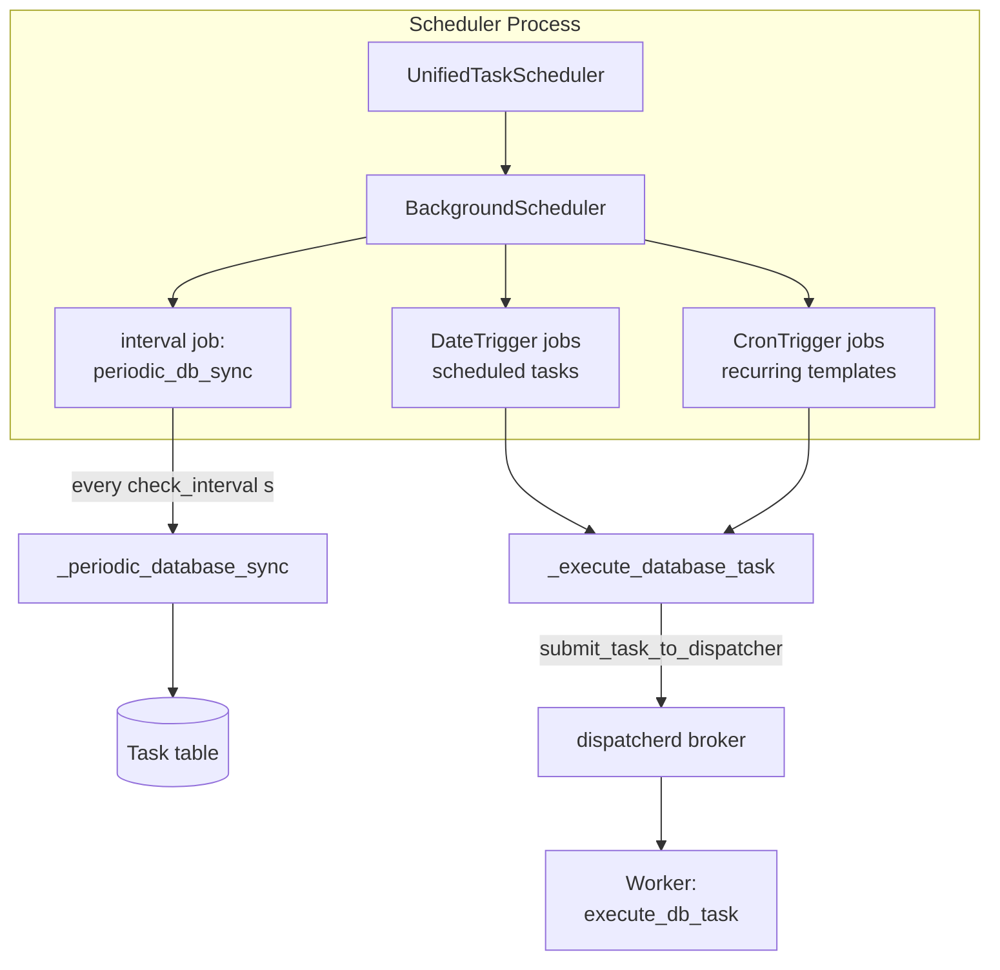
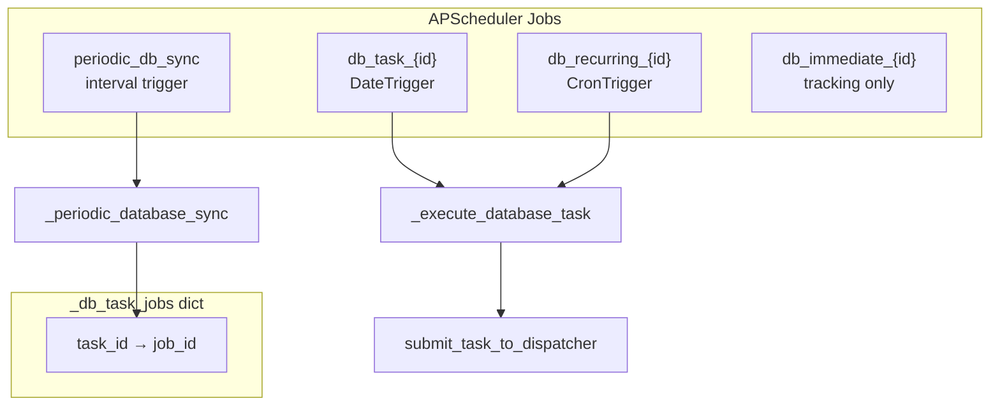
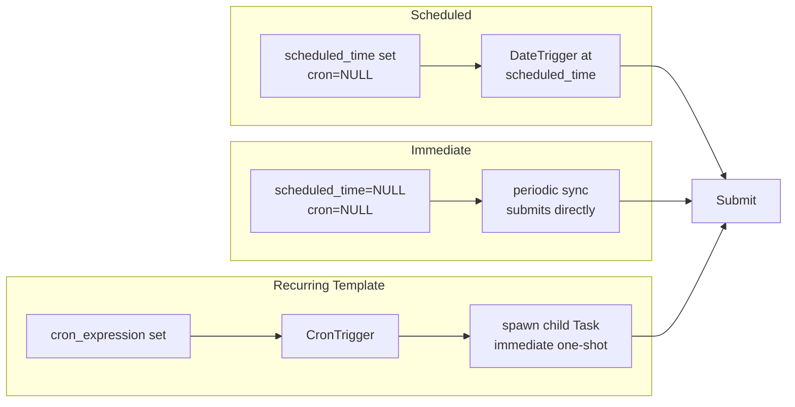
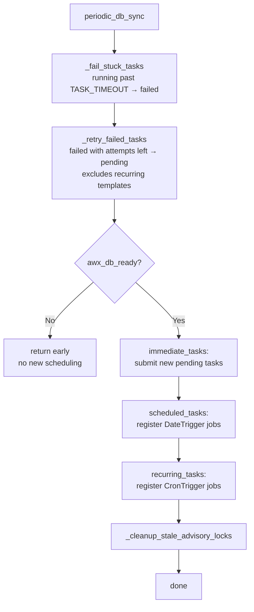

# APScheduler Integration

APScheduler is the **scheduling and reconciliation layer** for metrics-service
background tasks. It does not execute task Python code — it watches the
`Task` table, registers time-based triggers, and submits work to dispatcherd
workers.

See [task-system.md](task-system.md) for the overall architecture and
[task-state-machine.md](task-state-machine.md) for state transitions and
recovery semantics.

## Role in the Stack



| Component | File |
|-----------|------|
| `UnifiedTaskScheduler` | `apps/tasks/cron_scheduler.py` |
| Process entry point | `apps/tasks/management/commands/run_task_scheduler.py` |
| Singleton accessors | `start_scheduler()`, `get_scheduler()`, `stop_scheduler()` |

## UnifiedTaskScheduler Lifecycle

1. **Start** — `BackgroundScheduler.start()`, load existing scheduled/recurring
   tasks from DB, register `periodic_db_sync` interval job.
2. **Periodic sync** — every `check_interval` seconds (default **30**), run
   reconciliation (stuck tasks, retries, new task discovery, advisory lock cleanup).
3. **Trigger fire** — `DateTrigger` or `CronTrigger` calls `_execute_database_task`.
4. **Submit** — recurring templates spawn child tasks; all executable work goes
   to `submit_task_to_dispatcher()`.
5. **Stop** — shutdown scheduler, clear `_db_task_jobs`.

## Scheduler Internals



`_db_task_jobs` maps `Task.id` to APScheduler job IDs to prevent duplicate
registration and to track immediate tasks after submission.

## Task Shapes and Triggers



| Shape | APScheduler trigger | On fire |
|-------|---------------------|---------|
| Immediate | none (interval sync only) | `_execute_database_task` → submit |
| Scheduled | `DateTrigger(run_date=scheduled_time)` | submit (immediate if past due) |
| Recurring | `CronTrigger.from_crontab(cron_expression)` | create child `Task`, submit child |

Recurring template rows stay `pending` forever. Each fire creates a new child
with `cron_expression=None` and `scheduled_time=None`.

### Timestamp injection

Before submitting recurring child tasks, `_inject_dispatch_timestamps()` pins
time-window keys so retries collect the originally intended window:

| Function | Injected key | Value |
|----------|--------------|-------|
| `collect_hourly_metrics` | `hour_timestamp` | previous full hour |
| `collect_snapshot_metrics` | `collection_timestamp` | yesterday 23:00 |
| `collect_daily_metrics` | `hour_timestamp` | today 00:00 |

Keys are only set when absent, so manually created tasks with explicit timestamps
are unchanged.

## Periodic Sync Pipeline

`_periodic_database_sync()` runs on the interval job. Simplified flow:



**AWX DB gate** — Collector scheduling waits until the Controller database is
ready (`awx_db_ready()`). Stuck-task detection and retries run regardless of AWX
readiness. A 10-minute grace period escalates warnings to errors if AWX stays
unavailable (likely failed Controller migrations).

**Stuck tasks** — `_fail_stuck_tasks()` marks `running` tasks older than
`TASK_TIMEOUT` (from settings) as `failed`. Recovery details are in
[task-state-machine.md §4](task-state-machine.md#4-crash-recovery).

**Retries** — `_retry_failed_tasks()` calls `_schedule_retry()` for failed
non-recurring tasks with `attempts < max_attempts`. This is separate from
dispatcherd's broker-level retries.

## Feature Flag Checks

`_task_feature_flag_enabled()` reads `task_data["_feature_flag"]` and calls
`get_feature_enabled_from_db()`. Disabled tasks are skipped during:

- Initial sync of scheduled/recurring jobs
- Periodic discovery of immediate/scheduled/recurring tasks
- `_execute_database_task()` at fire time

Runtime checks allow toggling flags via DB/API without restarting the scheduler.

## Advisory Locks

Functions in `TASK_LOCKS` (`apps/tasks/tasks.py`) acquire PostgreSQL advisory
locks during scheduled execution to prevent overlapping collector runs.

`_cleanup_stale_advisory_locks()` terminates idle database sessions holding
locks matching `TASK_LOCKS` names when idle longer than `TASK_TIMEOUT`. This
handles network partitions that leave locks alive after workers are marked failed.

## CLI and the Check-Interval Quirk

```bash
python manage.py run_task_scheduler --check-interval 60
```

Two different intervals exist:

| Setting | Default | Controls |
|---------|---------|----------|
| `UnifiedTaskScheduler(check_interval=...)` | **30 seconds** | How often `_periodic_database_sync` runs |
| `--check-interval` CLI flag | **60 seconds** | How often the management command's idle loop wakes to verify the scheduler is still running |

The CLI flag does **not** currently pass its value to `UnifiedTaskScheduler`.
The periodic sync interval is hardcoded at 30 seconds in `start_scheduler()`.

The management command loop only checks `scheduler.running` and handles
`KeyboardInterrupt` shutdown — it does not drive scheduling.

## Failure Modes

| Failure | Effect | Recovery |
|---------|--------|----------|
| Scheduler process down | Tasks accumulate as `pending` in DB | Restart scheduler; periodic sync re-submits |
| Worker process down | Submitted tasks sit in broker; running tasks may stick | Workers restart; stuck tasks → failed → retry |
| AWX DB unavailable | Collectors not scheduled; retries/stuck detection continue | Scheduler retries every 30s until AWX ready |
| Broker publish error | Child/recurring execution stays `pending` | Next immediate-task scan re-submits |
| Feature flag disabled | Task skipped at sync and fire time | Re-enable flag; no restart needed (DB toggle) |

Dispatcherd may retry broker delivery independently. Application-level retries
use `task.retry()` and `_retry_failed_tasks()` — see
[task-state-machine.md §3](task-state-machine.md#3-transitions-reference).

## Related Documentation

- [task-system.md](task-system.md) — task groups, dispatcherd queues, API
- [task-state-machine.md](task-state-machine.md) — state machine and backoff formulas
- [collectors.md](collectors.md) — what scheduled collector tasks do
