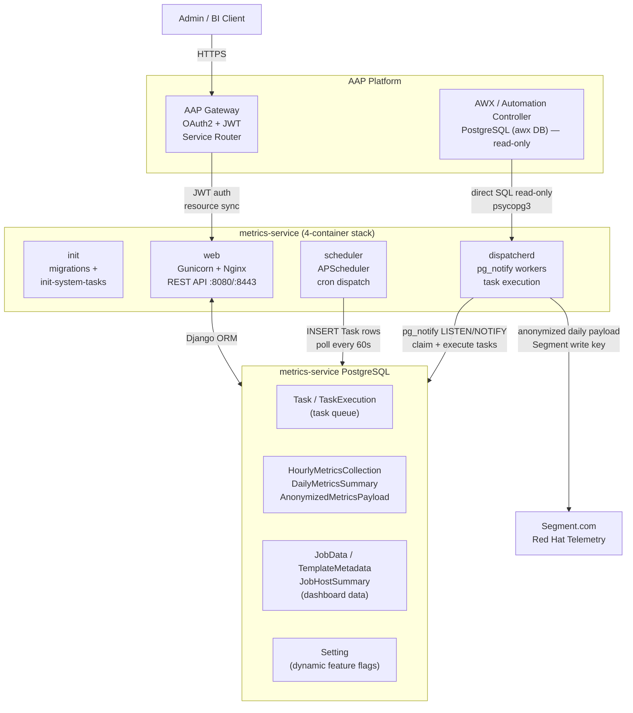

# System Overview

metrics-service is a Django-based telemetry service deployed as a 4-container stack. It connects read-only to the AWX/Automation Controller PostgreSQL database, aggregates and anonymizes usage metrics on a scheduled basis, and ships daily payloads to Segment.com for Red Hat telemetry. All external API access is brokered through AAP Gateway, which handles OAuth2/JWT authentication and resource registry synchronisation.

