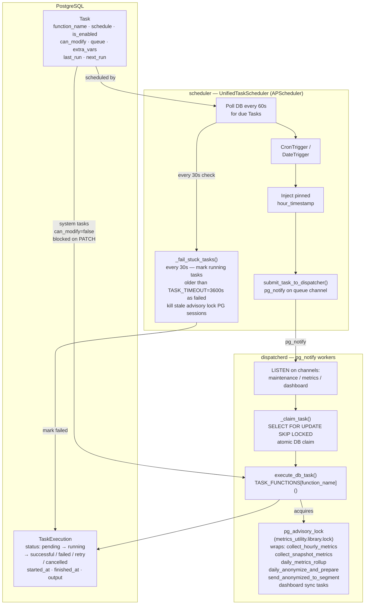

# Task System

The metrics-service task system is a three-layer pipeline: a PostgreSQL-backed `Task` model defines what runs and when, `UnifiedTaskScheduler` (backed by APScheduler) polls for due tasks and dispatches them via `pg_notify`, and `dispatcherd` workers listen on named channels to atomically claim and execute tasks. Advisory locks (`pg_advisory_lock`) prevent concurrent execution of heavyweight operations such as metrics collection and anonymization. Task lifecycle state is tracked in `TaskExecution`, with a background watchdog marking any task that exceeds `TASK_TIMEOUT=3600s` as failed.

