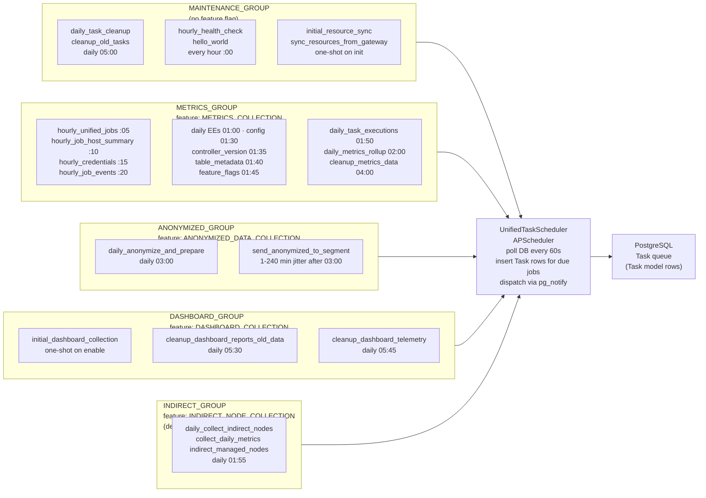

# APScheduler — Task Groups & Scheduled Jobs

The metrics-service scheduler process runs APScheduler and organises all scheduled work into five named task groups defined in `task_groups.py`. Each group maps to a queue and may be gated by a feature flag; the `UnifiedTaskScheduler` polls the database every 60 seconds, inserts `Task` model rows for any due jobs, and dispatches them to dispatcherd via `pg_notify`.

Groups and their tasks are registered at startup; one-shot tasks use a `DateTrigger` and fire only once, while recurring tasks use `IntervalTrigger` or `CronTrigger` schedules. All task state (due time, last run, status) is stored as rows in the PostgreSQL `Task` table.

