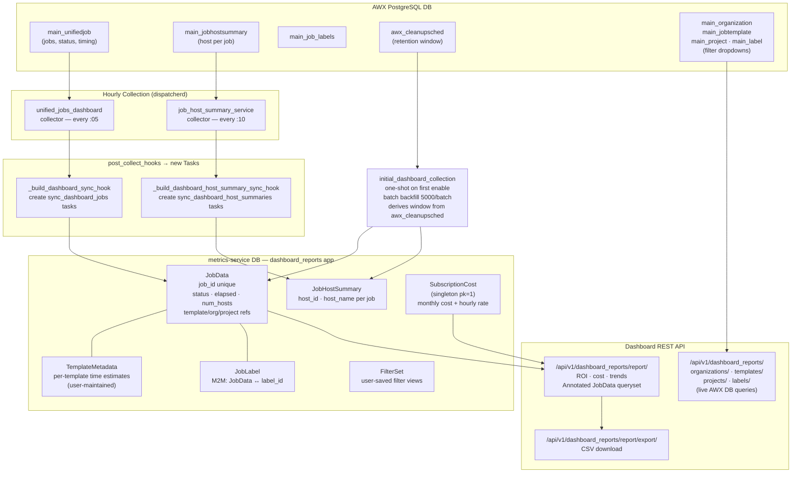

# Dashboard Collection System

The dashboard collection system mirrors AWX job execution data into metrics-service so that the Automation Dashboard can produce ROI, cost, and trend reports. Data arrives through two routes: an hourly incremental pipeline (query AWX DB → post_collect_hook → dispatcherd sync tasks → metrics-service DB) and a one-shot initial backfill that cursor-paginates through AWX's entire job history using the retention window from `awx_cleanupsched`. Report endpoints then serve annotated `JobData` querysets directly from the metrics-service DB, while filter-dropdown endpoints hit the live AWX DB on each request.

