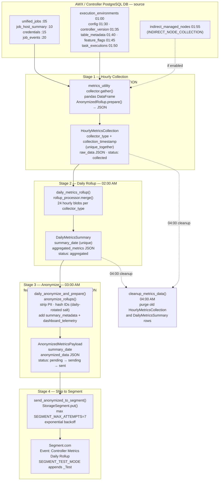

# Metrics Data Pipeline — Collection to Segment

The metrics-service runs a daily pipeline that collects AWX job and configuration data from the Controller PostgreSQL database, rolls it up, anonymizes it, and ships it to Segment for telemetry analysis. The pipeline is gated by two feature flags — `METRICS_COLLECTION` (stages 1–2) and `ANONYMIZED_DATA_COLLECTION` (stages 3–4) — and is orchestrated entirely by APScheduler jobs scheduled within the Django application.

Each stage produces a database record that serves as the input to the next stage, giving the pipeline durability and the ability to resume after failures without data loss.

