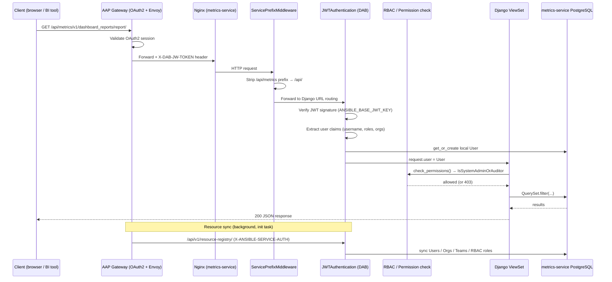

# Authentication & Request Flow

All external requests to metrics-service are routed through AAP Gateway, which validates the OAuth2 session and injects a signed JWT (`X-DAB-JW-TOKEN`) before forwarding to the service. Inside metrics-service, `ServicePrefixMiddleware` strips the `/api/metrics/` path prefix, then `JWTAuthentication` (from `django-ansible-base`) validates the JWT signature against `ANSIBLE_BASE_JWT_KEY` and gets-or-creates a local `User` object. DRF permission classes (`IsSystemAdminOrAuditor`) gate access before any ViewSet logic runs; a background `initial_resource_sync` task keeps the local identity store in sync with Gateway's resource registry.

