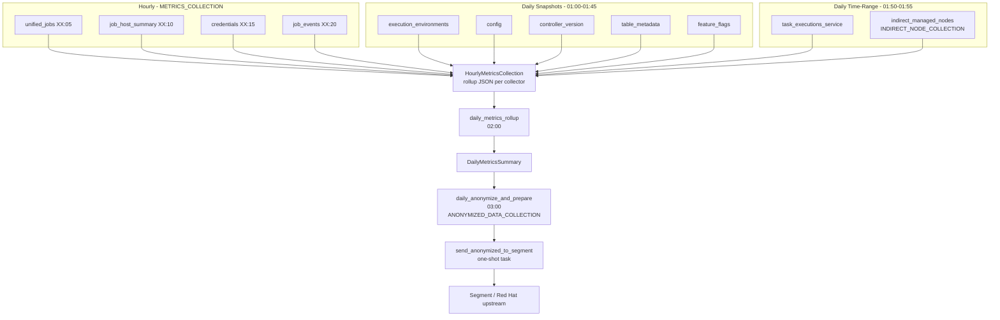

# Metrics Collectors

Collectors gather data from the AWX Controller database (and optionally the
metrics-service database), compute anonymized rollups via **metrics-utility**,
and store results for daily aggregation and optional upstream transmission.

Collector **schedules** live in `apps/tasks/task_groups.py`. Execution is
handled by the task system ([task-system.md](task-system.md)).

Dashboard sync hooks on two hourly collectors feed a separate pipeline — see
[dashboard-sync.md](dashboard-sync.md).

## Collection Pipeline



## Shared Collection Logic

All collectors delegate to `generic_collect_metrics()` in
`apps/tasks/utils.py`:

1. Resolve collector from a registry (`collector_type` key).
2. Call `metrics_utility` collector `gather()` against the target database.
3. Run optional `post_collect_hook(raw_data)` (dashboard sync uses this).
4. Compute rollup via `metrics_utility.anonymized_rollups` processor.
5. Persist rollup to `HourlyMetricsCollection`.

Collector SQL and gather logic live in the external **metrics-utility** package
(`metrics_utility.library.collectors`). metrics-service owns scheduling,
persistence, and downstream rollup/anonymization.

### Collector entry points

| Module | Function | Mode |
|--------|----------|------|
| `collect_hourly_metrics.py` | `collect_hourly_metrics` | Hourly time window |
| `collect_snapshot_metrics.py` | `collect_snapshot_metrics` | Point-in-time snapshot |
| `collect_daily_metrics.py` | `collect_daily_metrics` | Previous full calendar day |

## Schedule Timeline

```mermaid
gantt
    title Daily collector schedule (UTC-oriented cron)
    dateFormat HH:mm
    axisFormat %H:%M

    section Hourly
    unified_jobs           :05, 1h
    job_host_summary       :10, 1h
    credentials            :15, 1h
    job_events             :20, 1h

    section Daily
    execution_environments :01:00, 30m
    config                 :01:30, 5m
    controller_version     :01:35, 5m
    table_metadata         :01:40, 5m
    feature_flags          :01:45, 5m
    task_executions        :01:50, 5m
    indirect_nodes         :01:55, 5m
    daily_metrics_rollup   :02:00, 30m
    daily_anonymize        :03:00, 30m
    cleanup_metrics_data   :04:00, 30m
```

Cron expressions are defined in `METRICS_COLLECTION_GROUP` and
`INDIRECT_NODE_COLLECTION_GROUP` in `task_groups.py`.

## Hourly Collectors

Registry: `_get_hourly_collectors()` in `collect_hourly_metrics.py`.

| `collector_type` | metrics-utility source | Rollup class | Cron |
|--------------------|------------------------|--------------|------|
| `unified_jobs` | `unified_jobs_dashboard` | `JobsAnonymizedRollup` | `5 * * * *` |
| `job_host_summary_service` | `job_host_summary_service` | `JobHostSummaryAnonymizedRollup` | `10 * * * *` |
| `credentials_service` | `credentials_service` | `CredentialsAnonymizedRollup` | `15 * * * *` |
| `main_jobevent_service` | `main_jobevent_service` | `EventModulesAnonymizedRollup` | `20 * * * *` |

`unified_jobs` uses `unified_jobs_dashboard` (extra fields for dashboard sync).
The registry key remains `unified_jobs` for backward compatibility.

**Dashboard hooks** — `unified_jobs` and `job_host_summary_service` register
`post_collect_hook_factory` functions when `DASHBOARD_COLLECTION` is enabled.
See [dashboard-sync.md](dashboard-sync.md).

## Daily Snapshot Collectors

Registry: `_get_snapshot_collectors()` in `collect_snapshot_metrics.py`.

| `collector_type` | Source | Rollup | Cron |
|------------------|--------|--------|------|
| `execution_environments` | `execution_environments` | `ExecutionEnvironmentsAnonymizedRollup` | `0 1 * * *` |
| `config` | `config` | none (raw) | `30 1 * * *` |
| `controller_version_service` | `controller_version_service` | `ControllerVersionAnonymizedRollup` | `35 1 * * *` |
| `table_metadata` | `table_metadata` | `TableMetadataAnonymizedRollup` | `40 1 * * *` |
| `feature_flags_service` | `feature_flags_service` | `FeatureFlagsAnonymizedRollup` | `45 1 * * *` |

Snapshots are stored with a timestamp of yesterday 23:00 so
`daily_metrics_rollup` includes them in the daily window.

## Daily Time-Range Collectors

Registry: `_get_daily_collectors()` in `collect_daily_metrics.py`.

| `collector_type` | Source DB | Rollup | Cron | Enablement setting |
|------------------|-----------|--------|------|------|
| `task_executions_service` | `default` (metrics-service) | `TaskExecutionsAnonymizedRollup` | `50 1 * * *` | `METRICS_COLLECTION` |
| `indirect_managed_nodes` | `awx` | `IndirectManagedNodesAnonymizedRollup` | `55 1 * * *` | `INDIRECT_NODE_COLLECTION` |

These run once per day over the previous full calendar day (explicit
`since`/`until` window).

## Downstream Processing

### Daily rollup (`daily_metrics_rollup`)

Merges all `HourlyMetricsCollection` rollups for the target day into a single
`DailyMetricsSummary` record. Runs at 02:00 after all daily collectors complete.

### Anonymization (`daily_anonymize_and_prepare`)

Controlled by `ANONYMIZED_DATA_COLLECTION`. Anonymizes the daily summary and
creates a one-shot `send_anonymized_to_segment` task. Uses extended
`max_attempts` (7) for Segment transmission retries.

### Segment send (`send_anonymized_to_segment`)

Transmits anonymized payloads to Segment. Created dynamically by the anonymize
step, not registered as a recurring system task.

### Cleanup (`cleanup_metrics_data`)

Daily at 04:00. Removes old hourly collections, daily summaries, and payloads
based on retention settings in task args.

## Data Models

In `apps/tasks/models.py`:

| Model | Contents |
|-------|----------|
| `HourlyMetricsCollection` | Per-collector rollup JSON, timestamp, collector type |
| `DailyMetricsSummary` | Merged daily rollup across all collectors |
| `AnonymizedMetricsPayload` | Prepared payload for Segment transmission |

## Feature Enablement Settings

These **feature enablement settings** control whether collector task groups run.
They are separate from **platform feature flags** (DAB `AAPFlag` / the
`feature_flags_service` snapshot collector, which records Controller platform
flag state for metrics rollups).

| Enablement setting | Effect when disabled |
|--------------------|---------------------|
| `METRICS_COLLECTION` | All hourly/daily collectors, rollup, metrics cleanup skipped |
| `ANONYMIZED_DATA_COLLECTION` | Anonymization and Segment send skipped; local collection can continue |
| `INDIRECT_NODE_COLLECTION` | `indirect_managed_nodes` collector skipped |
| `DASHBOARD_COLLECTION` | Dashboard post-collect hooks skipped (metrics rollups still run) |

Enablement settings are checked at task execution time via `task_data["_feature_flag"]`.

## Related Documentation

- [task-system.md](task-system.md) — how collector tasks are scheduled and executed
- [dashboard-sync.md](dashboard-sync.md) — dashboard hooks on hourly collectors
- [apscheduler.md](apscheduler.md) — timestamp injection for recurring collector fires
