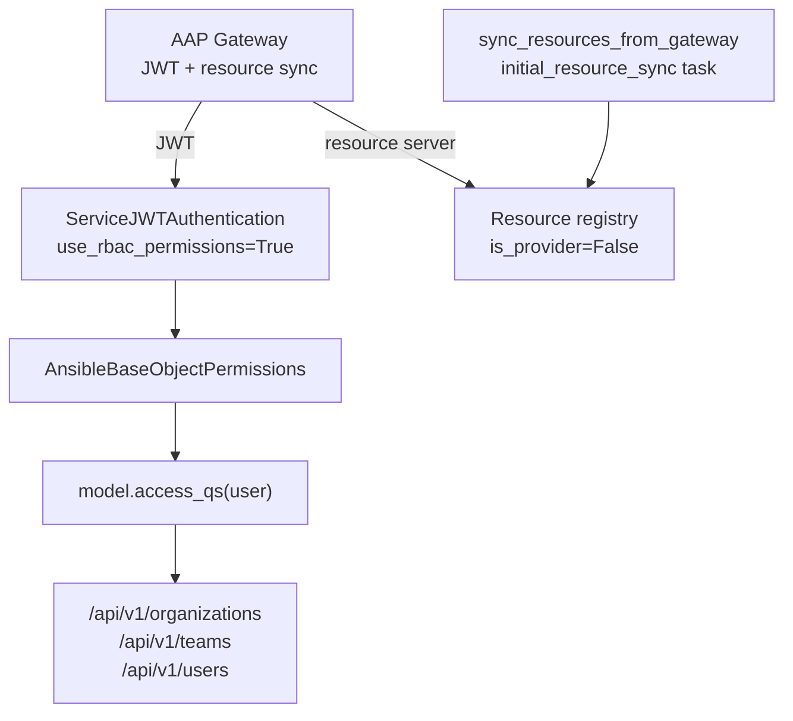
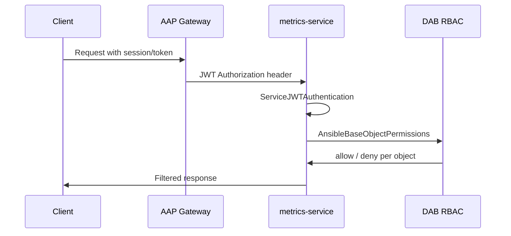
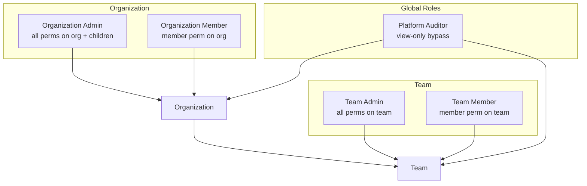
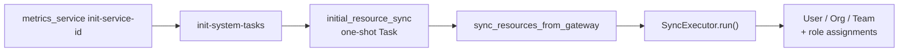

# Core, DAB, and RBAC

`apps/core` is the platform foundation for metrics-service. It provides
identity primitives (User, Organization, Team), integrates with
**django-ansible-base (DAB)**, and exposes versioned REST APIs protected by
RBAC.

## Architecture



## Django-Ansible-Base Integration

metrics-service is a **consumer** of gateway-managed resources, not a provider.

| Setting | Value | Purpose |
|---------|-------|---------|
| `AUTH_USER_MODEL` | `core.User` | Custom user model |
| `ANSIBLE_BASE_ORGANIZATION_MODEL` | `core.Organization` | Organization model |
| `ANSIBLE_BASE_TEAM_MODEL` | `core.Team` | Team model |
| `ANSIBLE_BASE_RESOURCE_CONFIG_MODULE` | `apps.core.resource_api` | Resource registry |
| `ANSIBLE_BASE_USER_VIEWSET` | `apps.core.v1.viewsets.user.UserViewSet` | Custom user API |

Resource registry (`apps/core/resource_api.py`) registers User, Organization,
and Team with `is_provider=False` — objects are synced **from** the gateway,
not published to it.

```python
SharedResource(serializer=OrganizationType, is_provider=False)
```

Creating organizations locally via POST is blocked (405) because gateway sync
is the source of truth (AAP-74775).

## Authentication Flow



`ServiceJWTAuthentication` (`apps/core/authentication.py`) extends DAB
`JWTAuthentication` with `use_rbac_permissions=True`. It is inserted at
position 0 in `REST_FRAMEWORK__DEFAULT_AUTHENTICATION_CLASSES`.

Production settings remove session authentication — JWT only.

### Platform Auditor bypass

`User.is_platform_auditor` checks for the global "Platform Auditor" role
(sent via JWT `global_roles`). Combined with
`ANSIBLE_BASE_BYPASS_ACTION_FLAGS = {"view": "is_platform_auditor"}` in defaults,
auditors get view access across registered resources.

## RBAC Hierarchy



### Managed roles

Created automatically on `migrate` via `ANSIBLE_BASE_MANAGED_ROLE_REGISTRY`:

| Registry key | Role name | Scope |
|--------------|-----------|-------|
| `sys_auditor` | Platform Auditor | Global, view bypass |
| `org_admin` | Organization Admin | Organization + children |
| `org_member` | Organization Member | Organization member |
| `team_admin` | Team Admin | Team |
| `team_member` | Team Member | Team |

`ANSIBLE_BASE_JWT_MANAGED_ROLES` lists roles synced from gateway JWTs when
`ALLOW_LOCAL_ASSIGNING_JWT_ROLES=True`. Set to `False` when using a resource
server for assignment sync.

### Model registry

```python
ANSIBLE_BASE_RBAC_MODEL_REGISTRY = {
    "core.Organization": {"parent_field_name": None},
    "core.Team": {"parent_field_name": "organization"},
    "core.User": {"parent_field_name": None},
}
```

## API Surface

### Core v1 endpoints (`apps/core/v1/router.py`)

| Endpoint | ViewSet | Methods | Notes |
|----------|---------|---------|-------|
| `/api/v1/organizations/` | `OrganizationViewSet` | GET, PUT, PATCH, DELETE | No POST — gateway-synced |
| `/api/v1/organizations/{id}/teams/` | nested `TeamViewSet` | via association | |
| `/api/v1/teams/` | `TeamViewSet` | full CRUD | |
| `/api/v1/teams/{id}/organization/` | nested `OrganizationViewSet` | via association | |
| `/api/v1/users/` | `UserViewSet` | CRUD (RBAC-gated) | List/retrieve need auditor+ |
| `/api/v1/users/me/` | `UserViewSet.me` | GET | Any authenticated user |

### DAB-provided RBAC endpoints (mounted at `/api/v1/`)

- `/api/v1/role_definitions/`
- `/api/v1/role_team_assignments/`, `/api/v1/role_user_assignments/`
- `/api/v1/role_team_access/`, `/api/v1/role_user_access/`
- `/api/v1/role_metadata/`
- `/api/v1/permissions/`, `/api/v1/content_types/`

### Other core endpoints

| Path | Auth |
|------|------|
| `/ping/`, `/health/` | AllowAny |
| `/api/v1/metrics` | Platform Auditor+ |
| `/api/v1/activitystream/` | Platform Auditor+ (AAP-74790) |
| `/api/v1/feature_flags_state/` | Platform Auditor+ (AAP-74790) |

## Permission Matrix

Derived from `apps/core/tests/rbac/test_viewset_permissions.py`:

| Action | Superuser | Platform Auditor | Org Admin | Team Admin | Team Member | Normal user |
|--------|-----------|------------------|-----------|------------|-------------|-------------|
| `GET /users/` | allow | allow | deny | deny | deny | deny |
| `GET /users/me/` | allow | allow | allow | allow | allow | allow |
| `POST /users/` | allow | — | deny | deny | deny | deny |
| `GET /organizations/` | allow | allow | own org | — | — | empty list |
| `POST /organizations/` | 405 | 403 | 403 | — | — | 403 |
| `PATCH /organizations/{id}/` | allow | allow | own org | — | — | deny |
| `POST /teams/` | allow | — | in own org | deny | deny | deny |
| `PATCH /teams/{id}/` | allow | — | — | own team | deny | deny |
| `GET /teams/` | allow | allow | — | own team | own team | empty list |
| `GET /activitystream/` | allow | allow | deny | deny | deny | deny |

Organizations cannot be created locally at any permission level — POST returns
405 for superuser or 403 for others.

## ViewSet Patterns

`BaseViewSet` (`apps/core/v1/viewsets/base.py`):

- `permission_classes = [AnsibleBaseObjectPermissions]`
- `filter_queryset()` applies `model.access_qs(user)` for RBAC-registered models

`UserViewSet` adds action-specific permissions:

- `me` → `IsAuthenticated`
- `list` / `retrieve` → `IsSystemAdminOrAuditor`
- writes → `IsSystemAdminOrAuditor` + `AnsibleBaseUserPermissions`

Serializers use `RelatedAccessMixin` on Organization/Team to expose RBAC
relationship data in API responses.

## Gateway Resource Sync



1. `init-service-id` — registers service ID for DAB resource registry.
2. `initial_resource_sync` system task runs `sync_resources_from_gateway`.
3. `SyncExecutor` pulls all shared resources and RBAC assignments from gateway.
4. Idempotent — safe on first boot and upgrades.

Organizations and teams are synced before user assignments to avoid
`DoesNotExist` on object-scoped roles.

Configure resource server in `RESOURCE_SERVER` settings (`apps/core/settings.py`).
`RESOURCE_SERVER_SYNC_ENABLED` controls automatic sync behavior.

## Gateway Deployment

Behind the AAP gateway, the service is mounted at `/api/metrics`:

- `ServicePrefixMiddleware` strips the gateway prefix and patches
  `get_full_path()` for DRF breadcrumbs.
- `URL_PREFIX` / `SCRIPT_NAME` configure path prefix handling.
- `ServiceBrowsableAPIRenderer` fixes browsable API links with prefix.

`NullByteQueryParamMiddleware` returns 400 for `%00` in query strings (AAP-74806).

`APIRootViewMiddleware` serves a dynamic endpoint index on 404 for paths with
child routes.

## Security Hardening

`CoreConfig.ready()` (`apps/core/apps.py`) patches insufficiently restricted
DAB views at startup:

- `EntryReadOnlyViewSet` (activity stream) → `IsSystemAdminOrAuditor`
- `OldFeatureFlagsStateListView` → `IsSystemAdminOrAuditor`

## Developer Guide: RBAC-Protected Resources

1. Create model and register in `ANSIBLE_BASE_RBAC_MODEL_REGISTRY` with parent
   field if nested.
2. Extend `BaseViewSet` for API access filtering.
3. Add managed roles or custom permissions as needed.
4. Add tests under `apps/core/tests/rbac/`.

**Pitfalls:**

- Do not POST organizations locally — use gateway sync.
- Set `ALLOW_LOCAL_ASSIGNING_JWT_ROLES=False` when resource server handles assignments.
- Run `init-service-id` before resource sync on fresh installs.

## Related Documentation

- [README.md](README.md) — architecture index and settings layering
- [task-system.md](task-system.md) — `sync_resources_from_gateway` task
- OpenAPI schema at `/api/docs/` when running locally
