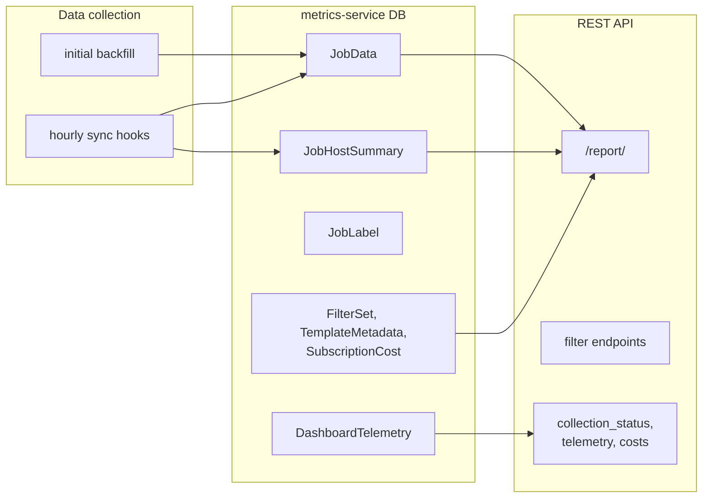

# Dashboard Reports API

The `apps/dashboard_reports` app exposes REST APIs for the **automation-reports**
dashboard UI. Data is populated by the sync pipeline described in
[dashboard-sync.md](dashboard-sync.md); this document covers the **consumer API**.

Base path: `/api/v1/dashboard_reports/`

Interactive schema: `/api/docs/` when the service is running.

## Architecture

## Authentication and Permissions

Most dashboard endpoints require **Platform Auditor** or system admin
(`IsSystemAdminOrAuditor` via `BaseAdminViewSet` or equivalent on report views).

| Audience | Typical role |
|----------|----------------|
| Dashboard UI (automation-reports) | Platform Auditor+ |
| Filter dropdowns / report analytics | Platform Auditor+ |
| Saved filter sets | Authenticated users (see `FilterSetsViewSet`) |

See [core-rbac.md](core-rbac.md) for JWT auth and role details.

## Endpoint Map

Registered in `apps/dashboard_reports/urls.py`:

| Path | ViewSet | Purpose |
|------|---------|---------|
| `/report/` | `DashboardReportViewSet` | Main job run metrics, charts, cost analytics |
| `/organizations/` | `OrganizationsViewSet` | AWX organizations for filter dropdowns |
| `/templates/` | `JobTemplatesViewSet` | AWX job templates for filters |
| `/projects/` | `ProjectsViewSet` | AWX projects for filters |
| `/labels/` | `LabelsViewSet` | AWX labels for filters |
| `/filter_sets/` | `FilterSetsViewSet` | Saved user filter configurations (CRUD) |
| `/subscription_costs/` | `SubscriptionCostViewSet` | Subscription cost settings for ROI calculations |
| `/template_metadata/` | `TemplateMetadataViewSet` | Per-template time estimates for cost math |
| `/collection_status/` | `DashboardCollectionStatusViewSet` | Enablement state and backfill status |
| `/collection_telemetry/` | `DashboardTelemetryViewSet` | Last 30 days of collection performance stats |

### Main report (`/report/`)

`DashboardReportViewSet` — read-only aggregated analytics over `JobData`:

- **List** — paginated report rows with filtering (`DateFilter`, `CustomReportFilter`)
- **`summary`** action — summary stats, chart data, top users/projects
- **`export`** action — CSV export

Query parameters include date ranges, organization/project/template filters,
and custom period validation via `validate_custom_period_dates`.

Data sources: `JobData`, `JobHostSummary`, `JobLabel`, `SubscriptionCost`,
`TemplateMetadata`.

### Filter option endpoints

`OrganizationsViewSet`, `JobTemplatesViewSet`, `ProjectsViewSet`, `LabelsViewSet`
extend `FilterOptionsViewSet` — paginated AWX-backed lists with `search` support
for UI dropdowns. Some queries use live AWX DB reads via `awx_queries.py`.

### Filter sets (`/filter_sets/`)

User-saved filter configurations stored in metrics-service DB (`FilterSet` model).
Full CRUD for authenticated users (not limited to auditor-only admin base).

### Subscription costs (`/subscription_costs/`)

Singleton-style `SubscriptionCost` record (monthly cost, engineer hourly rate,
template creation time toggle). List + update for admin/auditor.

### Template metadata (`/template_metadata/`)

Per job-template estimated run time used in cost calculations. Retrieve + update.

## Operator Endpoints

### Collection status (`/collection_status/`)

Returns feature enablement and pipeline state for operators:

| Field | Description |
|-------|-------------|
| `enabled` | `DASHBOARD_COLLECTION` enablement setting |
| `next_run` | Next `hourly_unified_jobs` cron fire (ongoing sync driver) |
| `initial_collection_status` | Status of one-shot `initial_dashboard_collection` task |
| `min_collection_timestamp` | Earliest `JobData` timestamp when data exists |

When `enabled` is `false`, timing fields are `null`.

### Collection telemetry (`/collection_telemetry/`)

Daily performance stats from `DashboardTelemetry` for the last 30 days (batch
counts, durations). No sensitive job payload data.

## Data Models (API layer)

| Model | Role in API |
|-------|-------------|
| `JobData` | Primary job execution records for reports |
| `JobHostSummary` | Per-host outcomes linked to jobs |
| `JobLabel` | Label associations on jobs |
| `FilterSet` | Saved filter UI state |
| `SubscriptionCost` | ROI / cost configuration |
| `TemplateMetadata` | Template duration estimates |
| `DashboardTelemetry` | Collection run metrics |

Full ER relationships: [data-models.md](data-models.md).

## Relationship to Metrics Pipeline

| Data | Dashboard API | Anonymization / Segment |
|------|---------------|-------------------------|
| `JobData` / host summaries | Full detail for local UI | Not transmitted |
| Hourly rollups | Not used directly | Anonymized aggregates only |
| `DashboardTelemetry` | Operator telemetry endpoint | Included in anonymized payload metadata |

Hourly collectors write **both** rollup JSON (metrics DB) and dashboard sync
tasks when respective enablement settings are on. See
[collectors.md](collectors.md) and [anonymization-and-transmission.md](anonymization-and-transmission.md).

## Related Documentation

- [dashboard-sync.md](dashboard-sync.md) — how `JobData` is populated
- [data-models.md](data-models.md) — model relationships
- [dynamic-settings.md](dynamic-settings.md) — `DASHBOARD_COLLECTION` enablement
- [core-rbac.md](core-rbac.md) — API authentication
