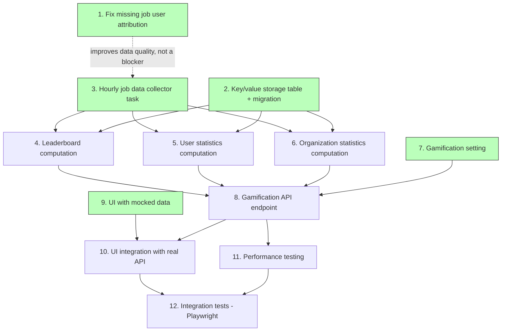

# Gamification — Issues Breakdown

## Dependency graph



Note: UI with mocked data (9) can start immediately in parallel with backend work. UI integration (10) connects it to the real API.

---

## Issue 1: Fix missing job user attribution in metrics-utility

**Depends on:** nothing (independent, can start immediately)

Investigate and fix the missing `launched_by_id` / `launched_by_username` for non-manual job types in `metrics-utility`. Currently, the collector SQL in `unified_jobs_dashboard.py` and `dashboard/queries.py` uses a CASE statement that only populates user references for `manual` and `relaunch` launch types — all other types (`scheduled`, `callback`, `dependency`) are NULLed out even though `main_unifiedjob.created_by_id` often has a valid user reference.

**Tasks:**
- Investigate all AWX `launch_type` values and document which ones have `created_by_id` populated
- Investigate how workflow child jobs work — they are currently excluded from `dashboard_job_data` entirely (AAP-74848 / AAP-85129); document whether this is correct for gamification or if the parent workflow job should be counted instead
- Expand the CASE statement to pass through `created_by_id` for `scheduled`, `callback`, and `dependency` types
- Unit tests for the updated SQL and sync behavior

This issue can be worked independently — all following backend issues consume this data, but they will function correctly even with incomplete user attribution (NULLs are filtered out in leaderboard queries, matching the existing Top Users pattern).

---

## Issue 2: Create key/value storage table in metrics-service

**Depends on:** nothing (independent, can start immediately)

Create a generic key/value storage model in `metrics-service` for persisting precomputed hourly data. This table will be used by the gamification feature and can be reused for any future precomputed data needs.

**Tasks:**
- Create a new Django model (e.g. `KeyValueStore`) with fields: `key` (CharField, unique), `value` (JSONField / jsonb), `created` (auto), `modified` (auto)
- Generate and review the migration
- Add basic model-level helpers for get/set/bulk upsert operations
- Unit tests for the model and helpers

---

## Issue 3: Implement hourly gamification data collector task

**Depends on:** nothing (can start before 1 and 2 — the collector loads data into a DataFrame; storage and attribution fixes integrate later)

Implement a scheduled task that collects all jobs with terminal status from `dashboard_job_data` for the last 30 days and loads them into a pandas DataFrame for downstream computation.

**Tasks:**
- Create a new collector function (e.g. `compute_gamification`) following the existing collector pattern in `apps/tasks/collectors/`
- Register it in `TASK_FUNCTIONS` / `TASK_METADATA` in `apps/tasks/tasks.py`
- Create a `GAMIFICATION_GROUP` TaskGroup in `apps/tasks/task_groups.py` with a cron schedule (e.g. `30 * * * *`, after unified_jobs at XX:05). The group checks the `GAMIFICATION` runtime setting (from `dynamic_settings.Setting`) before running tasks
- Query `dashboard_job_data` for the last 30 days with terminal status (`successful`, `failed`, `error`), loading into a pandas DataFrame with columns: `job_id`, `launched_by_id`, `launched_by_username`, `organization_id`, `organization_name`, `template_id`, `template_name`, `status`, `finished`. Most gamification metrics filter to `status='successful'` during computation, but failed/error jobs must be present in the DataFrame because the "Reliable" badge requires detecting failures between consecutive successful runs. Jobs without `launched_by_id` are still included — they contribute to enterprise/org streaks, calendar grids, at-a-glance totals, and org leaderboards; they are only excluded from user-level metrics (user leaderboard, dimensions, badges) during computation in issues 4 and 5
- The DataFrame is passed to downstream computation functions (issues 4, 5, 6) which store results via the KV table (issue 2)
- Unit tests for the collector, including empty data and large dataset edge cases

---

## Issue 4: Implement leaderboard and global statistics computation

**Depends on:**
- Key/value storage table
- Hourly gamification data collector task

Implement the computation logic that takes the 30-day jobs DataFrame (from issue 3) and produces the `gamification_global` JSON blob, then stores it in the key/value table.

**Tasks:**
- Compute enterprise streak: consecutive UTC calendar days with at least one successful job, with milestone detection at 7, 14, 30 days
- Compute 30-day calendar grid: one entry per day with `enterprise_active` boolean
- Compute at-a-glance stats: total successful jobs, count of active organizations, featured template (most-used by run count)
- Compute user leaderboard top 10: ranked by volume (total successful runs), ties broken alphabetically by username, with gold/silver/bronze for ranks 1-3. Each user entry must include their `organization_ids` so the API can determine which names to anonymize at response time
- Compute organization leaderboard top 10: ranked by total successful runs, ties broken alphabetically by org name
- Compute dimension top 10 lists: volume, breadth (distinct templates), consistency (distinct active days) — each with its own top 10 ranking
- Store the resulting JSON in the KV table under key `gamification_global`
- Unit tests for each computation, including edge cases: ties, fewer than 10 users/orgs, zero activity days, streak resets

---

## Issue 5: Implement per-user statistics computation

**Depends on:**
- Key/value storage table
- Hourly gamification data collector task

Implement the computation logic that produces one `gamification_user_{user_id}` JSON blob per user and stores each in the key/value table.

**Tasks:**
- For each user with at least one successful job in the 30-day window, compute:
  - Dimension scores: volume (total jobs), breadth (distinct templates), consistency (distinct active calendar days)
  - Dimension ranks: the user's position among all users for each dimension
  - Leaderboard rank and count (by volume)
  - Organization IDs: list of distinct orgs the user ran jobs in during the window
  - Milestone badges: ignition, week_warrior, month_warrior, explorer, centurion, reliable, accelerator — each evaluated against the rules defined in the requirements. The "Reliable" badge (20+ consecutive successful jobs with no failures/errors in between) requires ordering all of the user's jobs by `finished` timestamp and checking for failure gaps — this is why the collector loads failed/error jobs, not only successful ones. Badges are transient — they can appear and disappear as the 30-day sliding window moves. A badge is only active while its condition is currently met.
  - **Badge messages**: before saving new data, load the user's previous KV row (which contains `badges` map and existing `badge_messages` list). Compute badge transitions by diffing new vs. old `badges`. Maintain a `badge_messages` list with the following rules:
    - Each message: `{"badge": "<name>", "type": "badge_gained" | "badge_lost", "timestamp": "<ISO>"}`
    - Only the **last transition** per badge is stored. If a badge is gained and a `badge_gained` message already exists for it, update the timestamp. If the existing message is `badge_lost`, replace it with `badge_gained`. Same logic vice versa. At most one message per badge at any time.
    - **Prune messages older than 3 days** before appending new transitions.
    - Messages are **cleared on read** by the API endpoint (see Issue 8) — so if the user already retrieved the data since last computation, `badge_messages` will be empty and all transitions are fresh.
- Store each user's JSON blob under key `gamification_user_{user_id}`
- Bulk upsert all user rows efficiently (one or more transactions, not 2000 individual writes). Note: badge message computation requires loading previous rows before overwriting — batch-load all existing user KV rows at the start of computation to avoid N individual reads
- Clean up orphaned user rows for users no longer in the 30-day window
- Unit tests for each badge rule, rank computation, multi-org membership, badge message logic (new gain, new loss, duplicate gain deduplication, duplicate loss deduplication, replacement of opposite transition, 3-day pruning, empty messages after read, first-ever computation with no previous data), and edge cases (user with 1 job, user active all 30 days, exact threshold boundaries)

---

## Issue 6: Implement per-organization statistics computation

**Depends on:**
- Key/value storage table
- Hourly gamification data collector task

Implement the computation logic that produces one `gamification_org_{org_id}` JSON blob per organization and stores each in the key/value table.

**Tasks:**
- For each organization with at least one successful job in the 30-day window, compute:
  - Org streak: consecutive UTC calendar days with at least one successful job for this org, with milestone detection
  - Calendar days: list of dates this org had activity (for frontend overlay with the enterprise calendar grid)
  - Leaderboard rank and count (by volume, among all orgs)
  - Organization badges (three badges, each evaluated against the rules below). Badges are transient — they can appear and disappear as the 30-day sliding window moves:
    - **Sustained**: 14 or more consecutive org streak days within the 30-day window
    - **Rising**: More successful jobs in days 16–30 of the window than in days 1–15
    - **Top Tier**: Org currently ranked #1, #2, or #3 on the org leaderboard (current snapshot only, no historical rank tracking)
  - **Badge messages**: same logic as user badge messages (see Issue 5). Load previous org KV row, diff badges, maintain `badge_messages` list with one entry per badge (last transition only), prune messages older than 3 days, messages cleared on read by the API.
- Store each org's JSON blob under key `gamification_org_{org_id}`
- Bulk upsert all org rows efficiently - one upsert or multiple, but not 1 upsert per row. Note: badge message computation requires loading previous rows before overwriting — batch-load all existing org KV rows at the start
- Clean up orphaned org rows for orgs no longer in the 30-day window
- Unit tests for streak computation, calendar day generation, rank calculation, org badge evaluation (Sustained threshold at exactly 14 days, Rising with equal halves, Top Tier at rank boundary), badge message logic (gain, loss, deduplication, 3-day pruning, first computation with no prior data), and edge cases (org with 1 job, org active all 30 days)

---

## Issue 7: Implement gamification setting

**Depends on:** nothing (independent, can start immediately)

Add the `GAMIFICATION` setting to metrics-service as a runtime-toggleable admin setting using the `dynamic_settings.Setting` model (DB row). This is a setting, not a feature flag — it can be toggled by a platform administrator at runtime without restart or redeployment. When disabled, gamification tasks do not run and the API returns HTTP 404.

**Tasks:**
- Create a `GAMIFICATION` entry in the `dynamic_settings.Setting` model with default value `false` (disabled)
- Ensure the gamification `TaskGroup` checks this setting before running any tasks
- Ensure the API endpoint checks this setting and returns 404 when disabled
- Unit tests for setting enabled/disabled behavior

---

## Issue 8: Implement gamification API endpoint

**Depends on:**
- Leaderboard and global statistics computation
- Per-user statistics computation
- Per-organization statistics computation
- Gamification setting

Create the REST API endpoint that serves precomputed gamification data to the frontend.

**Tasks:**
- Create `GET /api/v1/dashboard_reports/gamification/` endpoint
- Resolve the authenticated user from the request token
- Look up 2 + N KV rows: `gamification_global`, `gamification_user_{user_id}`, and `gamification_org_{org_id}` for each org in the user's `organization_ids`
- Merge and return the combined JSON response: `{ "computed_at", "global", "my_orgs", "my_user" }`
- **Anonymize user names in the response**: for all user entries in `user_leaderboard_top10` and `dimension_top10` lists, mask usernames of users who do not share at least one common organization with the requesting user. Masked usernames are replaced with the uppercase first letter of each word part, split by word separators (`_`, `.`, `-`, spaces) — e.g. `"alice"` → `"A"`, `"bob_smith"` → `"B S"`, `"john.doe"` → `"J D"`. Users who share at least one org with the requester retain their full username. Organization names are never anonymized. Implementation: the serializer needs to cross-reference each leaderboard user's `organization_ids` (stored in their per-user KV blob) against the requesting user's orgs — this may require loading additional user KV rows or pre-indexing user-to-org membership during hourly computation
- **Clear badge messages on read**: after returning the response, clear `badge_messages` from the requesting user's KV row and from all of the user's org KV rows. This marks messages as "read" — subsequent requests return an empty `badge_messages` until the next hourly computation produces new transitions. The clear should be performed asynchronously (fire-and-forget DB update) to avoid adding latency to the response path
- Handle setting check: return HTTP 404 with detail message when `GAMIFICATION` setting is disabled
- Handle no-data case: return HTTP 200 with null fields and detail message when data has not been computed yet
- DRF serializer for response validation and OpenAPI documentation
- Unit tests for all response paths: normal data, setting disabled, no data yet, user not found in KV table, user with multiple orgs, **anonymization correctness** (verify same-org users show full name, different-org users show first letter only, edge cases: user in multiple orgs, user with single-character name), **badge message clear-on-read** (verify messages are returned then cleared, verify subsequent request returns empty messages, verify async clear does not block response)

---

## Issue 9: UI with mocked data — Highlights tab

**Depends on:** nothing (uses mocked API data, can start immediately)

Build the complete gamification Highlights tab in the Automation Dashboard, driven by a mock data provider. This allows UI development to proceed in parallel with backend work.

The Highlights tab must be gated by the `GAMIFICATION` setting. The UI detects this by calling the gamification API endpoint — if it returns HTTP 404, the setting is disabled and the Highlights tab should not be rendered (completely absent from the UI, not just empty or disabled).

**Tasks:**
- Create a new "Highlights" tab in the Automation Dashboard, conditionally rendered based on the gamification API response (HTTP 404 = setting disabled, hide tab)
- Create a mock data provider that returns the full API response shape (global + my_orgs + my_user) so all components work without the backend
- Display `computed_at` sync timestamp
- Implement the enterprise streak counter with flame icon and day count
- Implement the org streak counter alongside the enterprise streak
- Build the 30-day calendar grid with three visual states: enterprise-only activity, org + enterprise activity, no activity
- Implement milestone callout indicators at 7, 14, and 30 day thresholds
- Implement user leaderboard with top 10 entries: rank, medal icons (gold/silver/bronze for 1-3), username, and run count. Note: usernames from other organizations arrive pre-anonymized from the API as uppercase initials of each word part (e.g. "E W", "J D") — the UI renders them as-is without further processing
- Implement organization leaderboard with the same layout (org names are always shown in full, no anonymization)
- Add tab or toggle to switch between user and org leaderboards
- Implement "You" / "Your Org" row that appears when the current user/org is outside the top 10, visually distinguished
- Subtle animation on rank changes at refresh
- Build three dimension tiles (volume, breadth, consistency) showing the user's score and rank
- Implement per-dimension top 10 leaderboard accessible from each tile
- Implement the badge shelf showing all 7 individual badges: ignition, week_warrior, month_warrior, explorer, centurion, reliable, accelerator
- Earned badges shown lit with distinct icons; unearned badges shown locked/dimmed with their rule text visible
- Implement celebration animation when a badge is newly earned (use `badge_messages` entries with `type: "badge_gained"` from the API response). Show a visual cue or subtle indicator for recently lost badges (entries with `type: "badge_lost"`). Note: badges are transient and can appear/disappear as the 30-day window slides. Messages are cleared on read — the celebration is shown once per session then the API will return empty `badge_messages` on subsequent requests
- Implement "Your Org's Badges" row showing all 3 organization badges: sustained, rising, top_tier. Earned badges shown lit with distinct icons; unearned badges shown locked/dimmed with their rule text visible. Rules: Sustained (14+ consecutive org streak days), Rising (more jobs in days 16–30 than days 1–15), Top Tier (org ranked top 3)
- Build three at-a-glance stat tiles: "Jobs Run (30 Days)", "Active Organizations", "Featured Template"
- Large bold numbers as primary visual with supporting labels; template name truncation with ellipsis
- Unit tests for all components using mocked data

**Proposed mock API response:**

Note: usernames from users sharing at least one org with the requester are shown in full.
Usernames from other organizations are anonymized to uppercase first letter of each word
part (e.g. "bob_smith" → "B S"). Organization names are always shown in full.

```json
{
  "computed_at": "2026-08-14T09:00:00Z",
  "global": {
    "enterprise_streak": {
      "days": 28,
      "milestones": [7, 14]
    },
    "calendar_grid": [
      {"date": "2026-07-16", "enterprise_active": true},
      {"date": "2026-07-17", "enterprise_active": false}
    ],
    "at_a_glance": {
      "total_successful_jobs": 2700000,
      "active_organizations": 87,
      "featured_template": {"id": 42, "name": "Deploy backend", "count": 98000}
    },
    "user_leaderboard_top10": [
      {"rank": 1, "id": 7, "username": "alice", "count": 4200},
      {"rank": 2, "id": 55, "username": "E W", "count": 4100},
      {"rank": 3, "id": 1890, "username": "carol", "count": 3900}
    ],
    "org_leaderboard_top10": [
      {"rank": 1, "id": 3, "name": "Security", "count": 410000},
      {"rank": 2, "id": 1, "name": "Engineering", "count": 395000},
      {"rank": 3, "id": 9, "name": "DevOps", "count": 380000}
    ],
    "dimension_top10": {
      "volume": [
        {"rank": 1, "id": 7, "username": "alice", "score": 4200},
        {"rank": 2, "id": 55, "username": "E W", "score": 4100}
      ],
      "breadth": [
        {"rank": 1, "id": 55, "username": "E W", "score": 187},
        {"rank": 2, "id": 7, "username": "alice", "score": 34}
      ],
      "consistency": [
        {"rank": 1, "id": 1890, "username": "carol", "score": 30},
        {"rank": 2, "id": 400, "username": "D P", "score": 28}
      ]
    }
  },
  "my_orgs": [
    {
      "organization_id": 3,
      "name": "Security",
      "streak": {"days": 25, "milestones": [7, 14]},
      "calendar_days": ["2026-07-16", "2026-07-17", "2026-07-18"],
      "leaderboard_rank": 1,
      "leaderboard_count": 410000,
      "badges": {
        "sustained": true,
        "rising": false,
        "top_tier": true
      },
      "badge_messages": [
        {"badge": "top_tier", "type": "badge_gained", "timestamp": "2026-08-14T09:00:00Z"},
        {"badge": "rising", "type": "badge_lost", "timestamp": "2026-08-13T09:00:00Z"}
      ]
    },
    {
      "organization_id": 1,
      "name": "Engineering",
      "streak": {"days": 30, "milestones": [7, 14, 30]},
      "calendar_days": ["2026-07-16", "2026-07-17"],
      "leaderboard_rank": 2,
      "leaderboard_count": 395000,
      "badges": {
        "sustained": true,
        "rising": true,
        "top_tier": true
      },
      "badge_messages": [
        {"badge": "rising", "type": "badge_gained", "timestamp": "2026-08-14T09:00:00Z"}
      ]
    }
  ],
  "my_user": {
    "launched_by_id": 7,
    "username": "alice",
    "organization_ids": [3, 1],
    "dimensions": {
      "volume": {"score": 4200, "rank": 1},
      "breadth": {"score": 34, "rank": 82},
      "consistency": {"score": 27, "rank": 15}
    },
    "leaderboard_rank": 1,
    "leaderboard_count": 4200,
    "badges": {
      "ignition": true,
      "week_warrior": true,
      "month_warrior": false,
      "explorer": true,
      "centurion": true,
      "reliable": true,
      "accelerator": true
    },
    "badge_messages": [
      {"badge": "centurion", "type": "badge_gained", "timestamp": "2026-08-14T09:00:00Z"},
      {"badge": "month_warrior", "type": "badge_lost", "timestamp": "2026-08-13T09:00:00Z"}
    ]
  }
}
```

---

## Issue 10: UI integration with real API

**Depends on:**
- Gamification API endpoint
- UI with mocked data (Highlights tab)

Replace the mock data provider with the real gamification API endpoint and handle all runtime states.

**Tasks:**
- Replace the mock data provider with a fetch to `GET /api/v1/dashboard_reports/gamification/`
- Handle loading state while API call is in flight
- Handle setting disabled state (HTTP 404): hide Highlights tab entirely
- Handle no-data state (HTTP 200 with null fields): show messaging that data will be available after the next hourly computation
- Handle API errors gracefully with retry or error messaging
- Ensure all components render correctly with real data shapes (validate against actual API response)
- Handle multi-org users: org selector or combined view when `my_orgs` contains multiple entries
- Unit tests verifying data fetching, error handling, and state transitions

---

## Issue 11: Performance testing

**Depends on:** all backend issues:
- Fix missing job user attribution
- Key/value storage table
- Hourly gamification data collector task
- Leaderboard and global statistics computation
- Per-user statistics computation
- Per-organization statistics computation
- Gamification setting
- Gamification API endpoint

Validate that the gamification hourly computation and API perform within acceptable bounds at enterprise scale.

**Tasks:**
- Generate realistic test data at the largest expected scale: 5000 jobs/hour over 30 days (~3.6M rows), 2000 users, 100 organizations
- Measure end-to-end computation time for the hourly task (target: under 1 minute including SQL load, computation, and KV store writes)
- Measure SQL query time for the 30-day data load (target: several seconds)
- Measure API response time (target: sub-millisecond DB reads, under 50ms total response)
- Measure response payload size (target: ~30 KB)
- Test concurrent API requests under load
- Document results and identify any bottlenecks

---

## Issue 12: Integration tests — Playwright

**Depends on:**
- UI integration with real API
- Performance testing

End-to-end integration tests covering the full gamification experience from API through UI using Playwright.

**Tasks:**
- Test the Highlights tab loads and displays all sections: streak, calendar grid, leaderboards, dimensions, badges, at-a-glance
- Test leaderboard tab/toggle switching between users and organizations
- Test "You" / "Your Org" row appears correctly for users outside top 10
- Test badge states: earned vs unearned display, rule text visibility
- Test setting disabled state: Highlights tab hidden when API returns 404
- Test no-data state: appropriate messaging when gamification has not been computed yet
- Test with multiple orgs: user who belongs to multiple orgs sees all org data
- Test data refresh: content updates when `computed_at` changes

---

## Summary

| Issue | Title | Depends on | Repo |
|-------|-------|------------|------|
| 1 | Fix missing job user attribution | — | metrics-utility |
| 2 | Key/value storage table + migration | — | metrics-service |
| 3 | Hourly gamification data collector task | — | metrics-service |
| 4 | Leaderboard and global statistics computation | KV storage, Hourly collector | metrics-service |
| 5 | Per-user statistics computation | KV storage, Hourly collector | metrics-service |
| 6 | Per-organization statistics + org badges computation | KV storage, Hourly collector | metrics-service |
| 7 | Gamification runtime setting | — | metrics-service |
| 8 | Gamification API endpoint | Leaderboard, User stats, Org stats, Gamification setting | metrics-service |
| 9 | UI with mocked data (Highlights tab) | — (mocked data) | UI |
| 10 | UI integration with real API | API endpoint, UI with mocked data | UI |
| 11 | Performance testing | All backend issues | metrics-service |
| 12 | Integration tests (Playwright) | UI integration, Performance testing | cross-repo |

All issues include unit tests as part of their scope.
