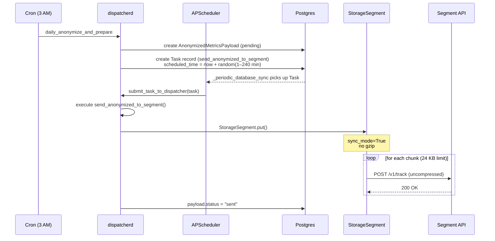
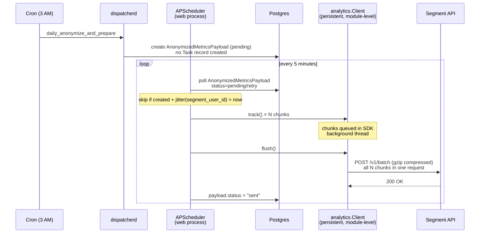
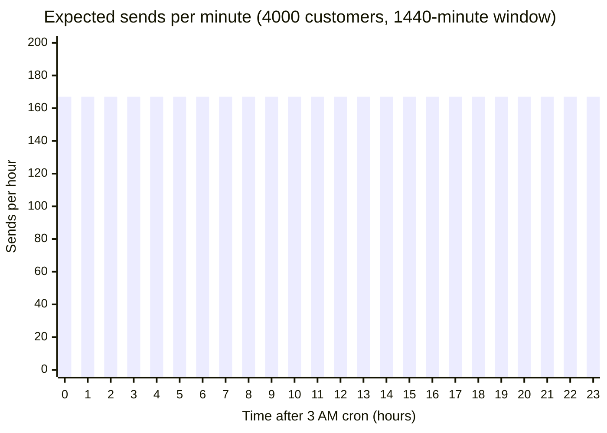
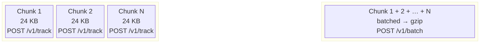
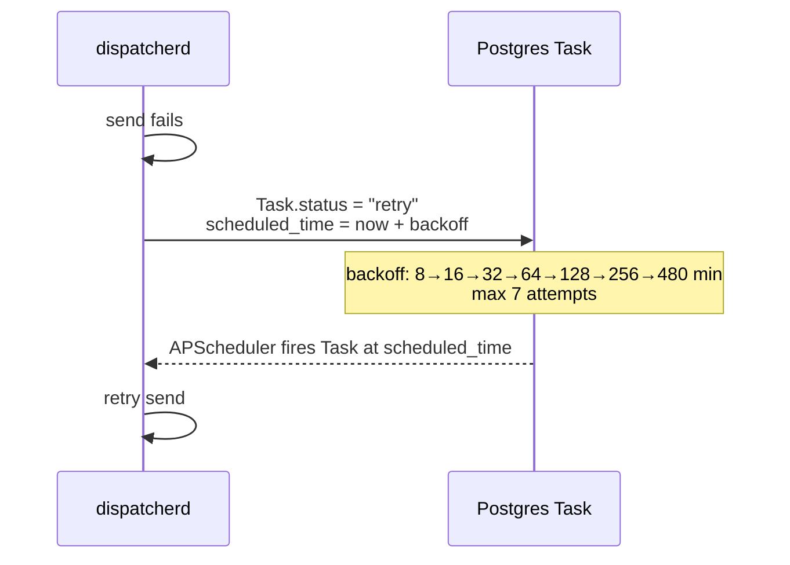
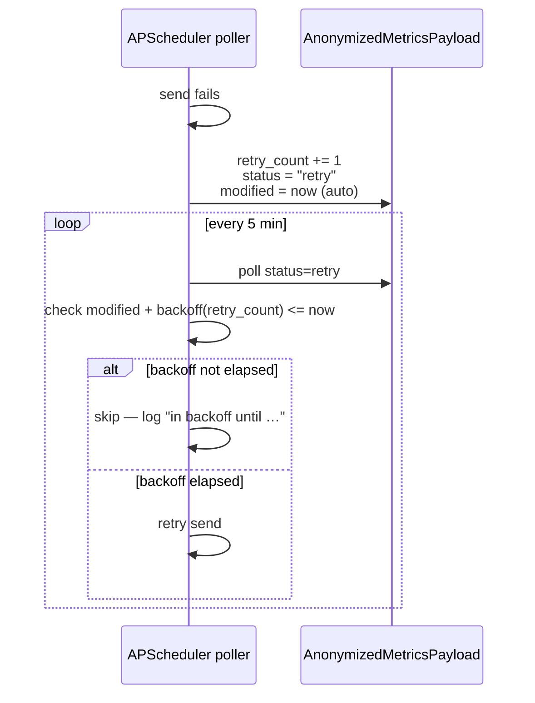
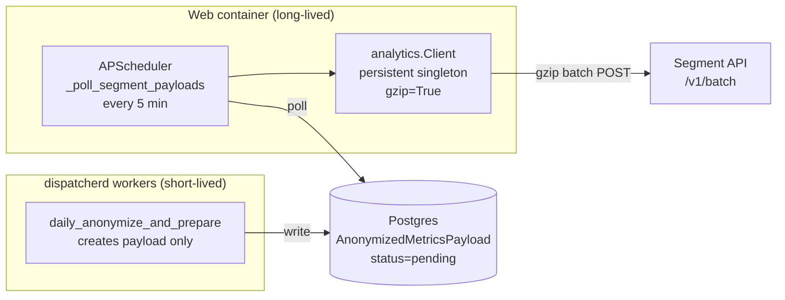

# Segment Send Architecture

Comparison of the old dispatcherd-based send path and the new APScheduler-native path introduced on `feat/segment-web-container-batch-send`.

---

## Old flow — dispatcherd (sync_mode=True, no gzip)

---

## New flow — APScheduler-native (sync_mode=False, gzip=True)

---

## Jitter distribution — 4000 customers over 24 hours

SHA-256 of `segment_user_id` gives a uniform distribution across the 1440-minute window.

| Customers | Window | Avg sends/min | Avg sends/hour |
|----------:|-------:|--------------:|---------------:|
| 200 | 240 min (old) | 0.8 | 50 |
| 4 000 | 240 min (old) | **16.7** | **1 000** |
| 4 000 | 1 440 min (new) | **2.8** | **167** |
| 10 000 | 1 440 min (new) | 6.9 | 417 |

---

## Wire size impact per payload

Each payload is split into chunks at the `StorageSegment.REGULAR_MESSAGE_LIMIT` boundary (24 KB of JSON).

| Metric | Old (sync_mode=True) | New (batch + gzip) |
|---|---|---|
| HTTP requests per payload | N (one per chunk) | **1** |
| Encoding | None (plain JSON) | **gzip** |
| Typical uncompressed size (10 chunks) | 10 × 24 KB = 240 KB | 240 KB |
| Typical wire size (10 chunks) | ~240 KB | **~30–50 KB** (~5–8× compression) |
| Segment endpoint | `/v1/track` × N | **`/v1/batch`** × 1 |
| Client lifecycle | New client per payload | **Persistent (process lifetime)** |

> **Compression note:** Metrics JSON is highly repetitive (repeated field names, numeric arrays, common strings). Gzip typically achieves 5–8× on this payload shape, so a 240 KB uncompressed payload lands around 30–50 KB on the wire.

---

## Retry and backoff

Both paths retry on failure, but the backoff schedules differ.

### Old path — dispatcherd backoff

Dispatcherd scheduled a new Task execution with exponential delay, handled entirely by the task system.

### New path — APScheduler backoff

The APScheduler poller uses `payload.modified` (auto-updated on each save) as the
failure timestamp and skips payloads that haven't waited long enough.

### Backoff schedule comparison

| Attempt | Old (dispatcherd) | New (APScheduler) |
|--------:|------------------:|------------------:|
| 1 | 8 min | 8 min |
| 2 | 16 min | 16 min |
| 3 | 32 min | 32 min |
| 4 | 64 min | 64 min |
| 5 | 128 min | 128 min |
| 6 | 256 min | 256 min |
| 7 | 480 min (cap) | 480 min (cap) |
| Max attempts | 7 (SEGMENT_MAX_ATTEMPTS) | `payload.max_retries` (model field) |

The backoff formula is `min(8 × 2^(retry_count − 1), 480)` in both paths.
`payload.modified` is `auto_now=True` so it captures the last failure time without a
separate DB field.

---

## Component ownership

The persistent client lives in the web process, which survives across daily sends.
Dispatcherd workers remain short-lived and are no longer involved in the send path.
