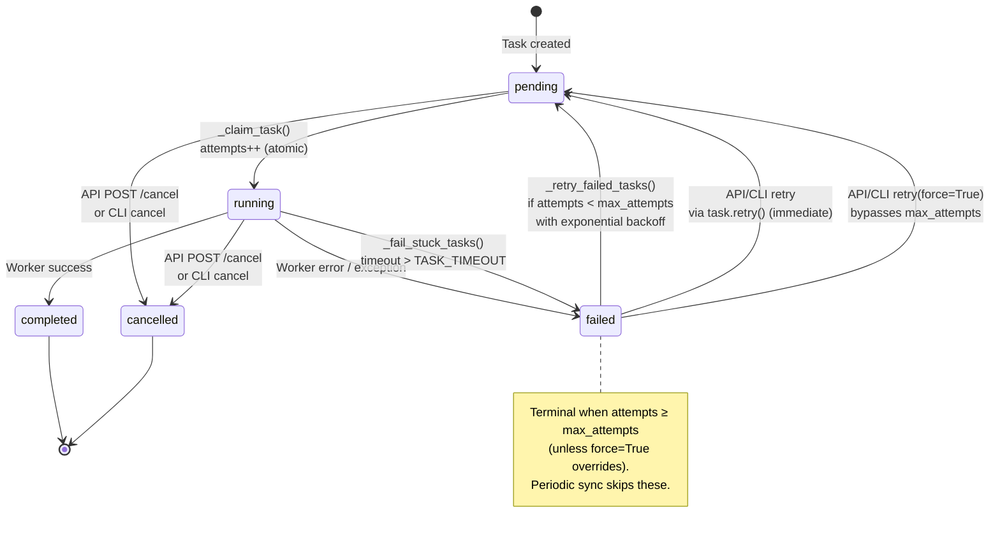
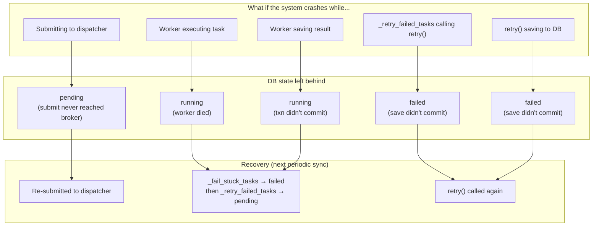
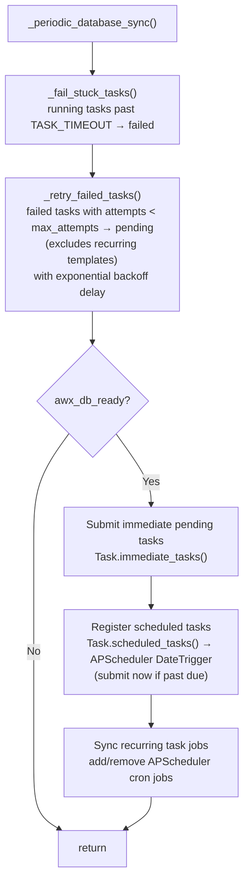
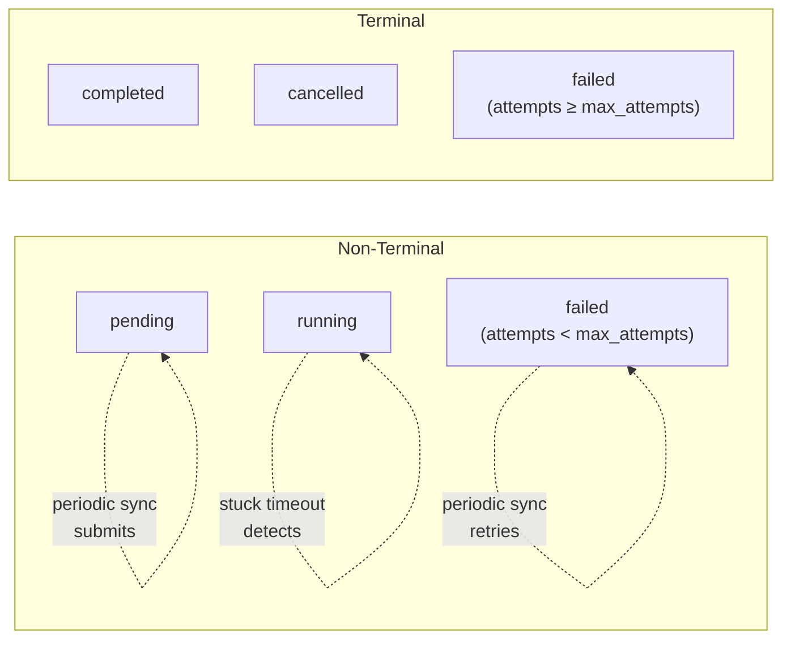

# Task State Machine

The task system uses five states. Every non-terminal state is self-recovering
via the 30-second periodic sync — if the process crashes at any point, the
database state alone is enough to resume.

## 1. Core State Machine



## 2. Task Types and Entry Paths

Every task is a `Task` row. Three shapes exist, distinguished by `scheduled_time`
and `cron_expression`. They differ only in *how they enter* the state machine —
once a task is `pending` and due, all three flow through the same
`pending → running → completed/failed` cycle from §1.

| Type | `scheduled_time` | `cron_expression` | Query | How it enters |
|------|------------------|-------------------|-------|---------------|
| Immediate | `NULL` | `NULL` | `Task.immediate_tasks()` | Periodic sync submits it to the dispatcher right away |
| Scheduled | set | `NULL` | `Task.scheduled_tasks()` | APScheduler `DateTrigger` at `scheduled_time` (submitted immediately if past due) |
| Recurring | `NULL` | set | `Task.recurring_tasks()` | APScheduler `CronTrigger` — the row is a template, see below |

### Recurring tasks are templates

A recurring task (`cron_expression` set) **never runs itself**. On each cron fire,
`_execute_database_task()` creates a fresh one-shot child `Task`
(`cron_expression=None`, `scheduled_time=None`) and submits *that*; the recurring
row stays `pending` forever as a template.

The child is therefore an ordinary **immediate** task and runs through the full
state machine — claim, execute, fail, retry — exactly like any other. It is not a
special case; only the *template* is:

- `_fail_stuck_tasks()` only touches `status="running"`, and a template is never running
- `_retry_failed_tasks()` excludes `cron_expression IS NOT NULL` — a template never
  fails, so it never needs retrying; its children fail and retry normally

Wherever this doc says a transition is "non-recurring only," it means the special-cased
template is skipped — the recurring task's spawned children are still fully processed.

### Retried tasks become scheduled

`retry(delay_seconds=N)` sets `scheduled_time = now + N`, so a failed task waiting out
its backoff delay is effectively a **scheduled** task until the delay elapses
(`ready_to_run()` won't claim it before `scheduled_time`).

## 3. Transitions Reference

| # | From | To | Trigger | Code | attempts? |
|---|------|----|---------|------|-----------|
| 1 | `pending` | `running` | Dispatcher worker picks up task | `tasks_system.py:_claim_task()` | +1 (atomic F-expression) |
| 2 | `running` | `completed` | Task function returns success | `utils.py:update_task_status()` | no |
| 3 | `running` | `failed` | Task function returns error | `utils.py:update_task_status()` | no |
| 4 | `running` | `failed` | Unhandled exception in worker | `utils.py:handle_task_error()` | no |
| 5 | `running` | `failed` | Stuck beyond TASK_TIMEOUT (1h) | `cron_scheduler.py:_fail_stuck_tasks()` | no |
| 6 | `pending` | `failed` | Error before _claim_task runs | `utils.py:handle_task_error()` | +1 |
| 7 | `failed` | `pending` | Periodic retry (auto, non-recurring only) | `cron_scheduler.py:_retry_failed_tasks()` → `task.retry()` | no (already counted) |
| 8 | `failed` | `pending` | API `POST /retry` | `v1/views.py` → `task.retry()` | no |
| 9 | `failed` | `pending` | CLI `tasks retry <id>` | `metrics_service.py` → `task.retry()` | no |
| 10 | `failed` | `pending` | CLI `tasks retry <id> --force` | `metrics_service.py` → `task.retry(force=True)` | no |
| 11 | `pending` | `cancelled` | API `POST /cancel` or CLI | `v1/views.py` / `metrics_service.py` | no |
| 12 | `running` | `cancelled` | API `POST /cancel` or CLI | `v1/views.py` / `metrics_service.py` | no |

### Retry paths

All retry paths go through `task.retry()` (`models.py`), which is an atomic
conditional update — it issues `UPDATE ... WHERE status='failed'` (and
`attempts < max_attempts` unless `force=True`), preventing races with
concurrent `_claim_task` or other retry callers. It never submits to the
dispatcher.

| Caller | Guard | Delay | Notes |
|--------|-------|-------|-------|
| `_retry_failed_tasks` (periodic) | `can_retry()` | exponential backoff | sole automatic retry mechanism |
| API `POST /retry` | `can_retry()` | none (immediate) | user-initiated |
| CLI `tasks retry` | `can_retry()` | none (immediate) | user-initiated |
| CLI `tasks retry --force` | `status == "failed"` only | none (immediate) | `retry(force=True)`, bypasses max_attempts |

Key invariant: `attempts` is incremented exactly once per execution attempt,
in `_claim_task()`, via an atomic `UPDATE ... SET attempts = attempts + 1
WHERE status = 'pending'`. This guarantees convergence — every retry burns
one attempt, and `max_attempts` (default 3) caps the total.

Exception: `handle_task_error()` increments attempts when a task fails before
reaching `_claim_task` (previous_status == "pending"), since the atomic
increment never ran.

## 4. Crash Recovery

Every state is self-recovering. The periodic sync
(`_periodic_database_sync`) is the sole recovery mechanism.



The periodic sync has three distinct, non-overlapping recovery handlers:

- **Orphaned `pending`** (submit never reached the broker) → recovered by the
  `immediate_tasks()` re-submission scan, **not** the retry path. A `pending`
  task that isn't tracked in `_db_task_jobs` is simply re-submitted.
- **Stuck `running`** (worker died) → `_fail_stuck_tasks()` moves it to `failed`,
  then `_retry_failed_tasks()` retries it on the next pass.
- **`failed` with attempts remaining** → `_retry_failed_tasks()` → `retry()`.

Only the last two involve the retry path; `_retry_failed_tasks()` acts solely on
`status="failed"`.

## 5. Periodic Sync Flow

`_periodic_database_sync()` runs every 30–60 seconds (class default 30s,
management command default 60s) and handles all state recovery in a single pass.



## 6. Attempt Counting and Backoff

```
Attempt budget: max_attempts (default 3)

  pending ──[_claim_task: attempts++ ]──► running ──► failed
                                                        │
                                        attempts < max? │
                                              ┌─────────┘
                                              ▼
                                    _retry_failed_tasks
                                    compute backoff delay
                                              │
                                              ▼
                                  pending (with scheduled_time)
                                              │
                              (wait for backoff to elapse)
                                              │
                                              ▼
                                    ... next attempt ...
```

Backoff formula (`tasks_system.py:compute_retry_delay`):

```
delay = min(base_delay × 2^(attempts-1), max_delay)

base_delay = task_data["retry_delay_seconds"] or RETRY_BASE_DELAY_SECONDS (480s / 8min)
max_delay  = RETRY_MAX_DELAY_SECONDS (28800s / 8h)
```

| Failure # | attempts | Delay before next run |
|-----------|----------|-----------------------|
| 1st | 1 | 8 min |
| 2nd | 2 | 16 min |
| **3rd** | **3** | **32 min** ← default max_attempts (terminal after this) |
| 4th | 4 | 64 min |
| 5th | 5 | 128 min |
| 6th | 6 | 256 min |
| **7th+** | **7+** | **8h (capped)** ← `daily_anonymize_and_prepare` max_attempts |

Each individual delay is capped at `RETRY_MAX_DELAY_SECONDS` (8h).

After `max_attempts` failures, the task stays `failed` permanently
(until a manual retry via CLI `--force`, i.e. `task.retry(force=True)`).

## 7. Data Model: Task vs TaskExecution

```
Task (one per logical task)
├── status, attempts, max_attempts
├── started_at, completed_at          ← current/last run timestamps
├── error_message                     ← cleared on retry()
└── executions → [TaskExecution, ...] ← one row per attempt, never overwritten

TaskExecution (one per attempt)
├── status
├── started_at (auto_now_add)         ← immutable once created
├── completed_at
├── error_message
├── result_data
└── execution_time_seconds            ← auto-calculated on save
```

`_claim_task()` creates a new `TaskExecution` per attempt.
`retry()` only touches the `Task` — old `TaskExecution` records are preserved.
`_fail_stuck_tasks()` only updates executions with `status="running"`.

A recurring task adds a second layer: each cron fire creates a new child `Task`
(not just a `TaskExecution`), and that child owns its own `TaskExecution` rows.
The recurring template itself never gains executions — see §2.

## 8. Terminal vs Non-Terminal States



Non-terminal states all have a periodic sync handler that drives them
toward resolution. Terminal states are ignored by the sync.

## 9. Design Invariants

These are the rules the state machine depends on for correctness.
The `/state-machine-review` skill checks these automatically.

1. **`submit_task_to_dispatcher` never sets status** — it raises on failure so callers decide error policy
2. **`retry()` is an atomic state writer** — conditional `UPDATE WHERE status='failed'`, never calls submit, never touches TaskExecution
3. **Periodic sync is the sole automatic retry** — `execute_claimed` and `execute_db_task` never call retry
4. **`attempts` increments exactly once per attempt** — in `_claim_task` (atomic) or `handle_task_error` (pre-claim failure)
5. **Terminal states are never overwritten** — `_claim_task` filters `status='pending'`, `_fail_stuck_tasks` filters `status='running'`
6. **All retry callers go through `task.retry()`** — API, CLI, and periodic scheduler; no manual field setting
7. **Only `_claim_task` sets `running`** — `update_task_status` raises `ValueError` on `status="running"`; the `pending → running` claim (set `started_at`, increment `attempts`) is owned exclusively by `_claim_task`, atomically
